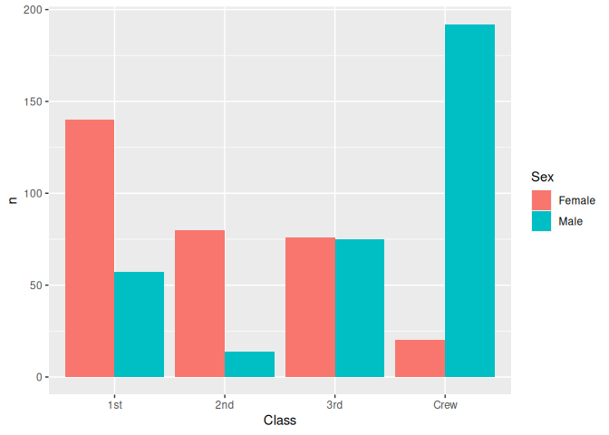
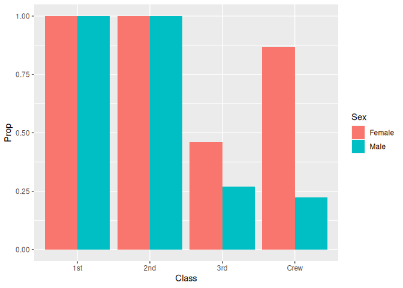
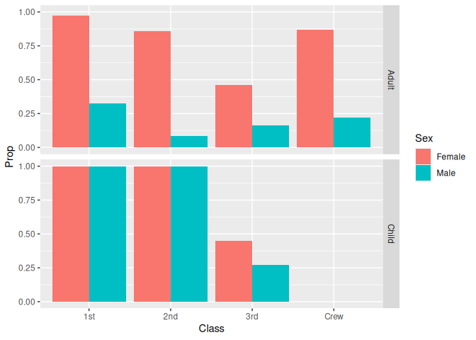

RMS Titanic
================
Andrew Mascillaro
2023-01-21

- <a href="#grading-rubric" id="toc-grading-rubric">Grading Rubric</a>
  - <a href="#individual" id="toc-individual">Individual</a>
  - <a href="#due-date" id="toc-due-date">Due Date</a>
- <a href="#first-look" id="toc-first-look">First Look</a>
  - <a
    href="#q1-perform-a-glimpse-of-df_titanic-what-variables-are-in-this-dataset"
    id="toc-q1-perform-a-glimpse-of-df_titanic-what-variables-are-in-this-dataset"><strong>q1</strong>
    Perform a glimpse of <code>df_titanic</code>. What variables are in this
    dataset?</a>
  - <a
    href="#q2-skim-the-wikipedia-article-on-the-rms-titanic-and-look-for-a-total-count-of-souls-aboard-compare-against-the-total-computed-below-are-there-any-differences-are-those-differences-large-or-small-what-might-account-for-those-differences"
    id="toc-q2-skim-the-wikipedia-article-on-the-rms-titanic-and-look-for-a-total-count-of-souls-aboard-compare-against-the-total-computed-below-are-there-any-differences-are-those-differences-large-or-small-what-might-account-for-those-differences"><strong>q2</strong>
    Skim the Wikipedia article on the RMS Titanic, and look for a total
    count of souls aboard. Compare against the total computed below. Are
    there any differences? Are those differences large or small? What might
    account for those differences?</a>
  - <a
    href="#q3-create-a-plot-showing-the-count-of-persons-who-did-survive-along-with-aesthetics-for-class-and-sex-document-your-observations-below"
    id="toc-q3-create-a-plot-showing-the-count-of-persons-who-did-survive-along-with-aesthetics-for-class-and-sex-document-your-observations-below"><strong>q3</strong>
    Create a plot showing the count of persons who <em>did</em> survive,
    along with aesthetics for <code>Class</code> and <code>Sex</code>.
    Document your observations below.</a>
- <a href="#deeper-look" id="toc-deeper-look">Deeper Look</a>
  - <a
    href="#q4-replicate-your-visual-from-q3-but-display-prop-in-place-of-n-document-your-observations-and-note-any-newdifferent-observations-you-make-in-comparison-with-q3-is-there-anything-fishy-in-your-plot"
    id="toc-q4-replicate-your-visual-from-q3-but-display-prop-in-place-of-n-document-your-observations-and-note-any-newdifferent-observations-you-make-in-comparison-with-q3-is-there-anything-fishy-in-your-plot"><strong>q4</strong>
    Replicate your visual from q3, but display <code>Prop</code> in place of
    <code>n</code>. Document your observations, and note any new/different
    observations you make in comparison with q3. Is there anything
    <em>fishy</em> in your plot?</a>
  - <a
    href="#q5-create-a-plot-showing-the-group-proportion-of-occupants-who-did-survive-along-with-aesthetics-for-class-sex-and-age-document-your-observations-below"
    id="toc-q5-create-a-plot-showing-the-group-proportion-of-occupants-who-did-survive-along-with-aesthetics-for-class-sex-and-age-document-your-observations-below"><strong>q5</strong>
    Create a plot showing the group-proportion of occupants who <em>did</em>
    survive, along with aesthetics for <code>Class</code>, <code>Sex</code>,
    <em>and</em> <code>Age</code>. Document your observations below.</a>
- <a href="#notes" id="toc-notes">Notes</a>

*Purpose*: Most datasets have at least a few variables. Part of our task
in analyzing a dataset is to understand trends as they vary across these
different variables. Unless we’re careful and thorough, we can easily
miss these patterns. In this challenge you’ll analyze a dataset with a
small number of categorical variables and try to find differences among
the groups.

*Reading*: (Optional) [Wikipedia
article](https://en.wikipedia.org/wiki/RMS_Titanic) on the RMS Titanic.

<!-- include-rubric -->

# Grading Rubric

<!-- -------------------------------------------------- -->

Unlike exercises, **challenges will be graded**. The following rubrics
define how you will be graded, both on an individual and team basis.

## Individual

<!-- ------------------------- -->

| Category    | Needs Improvement                                                                                                | Satisfactory                                                                                                               |
|-------------|------------------------------------------------------------------------------------------------------------------|----------------------------------------------------------------------------------------------------------------------------|
| Effort      | Some task **q**’s left unattempted                                                                               | All task **q**’s attempted                                                                                                 |
| Observed    | Did not document observations, or observations incorrect                                                         | Documented correct observations based on analysis                                                                          |
| Supported   | Some observations not clearly supported by analysis                                                              | All observations clearly supported by analysis (table, graph, etc.)                                                        |
| Assessed    | Observations include claims not supported by the data, or reflect a level of certainty not warranted by the data | Observations are appropriately qualified by the quality & relevance of the data and (in)conclusiveness of the support      |
| Specified   | Uses the phrase “more data are necessary” without clarification                                                  | Any statement that “more data are necessary” specifies which *specific* data are needed to answer what *specific* question |
| Code Styled | Violations of the [style guide](https://style.tidyverse.org/) hinder readability                                 | Code sufficiently close to the [style guide](https://style.tidyverse.org/)                                                 |

## Due Date

<!-- ------------------------- -->

All the deliverables stated in the rubrics above are due **at midnight**
before the day of the class discussion of the challenge. See the
[Syllabus](https://docs.google.com/document/d/1qeP6DUS8Djq_A0HMllMqsSqX3a9dbcx1/edit?usp=sharing&ouid=110386251748498665069&rtpof=true&sd=true)
for more information.

``` r
library(tidyverse)
```

    ## ── Attaching packages ─────────────────────────────────────── tidyverse 1.3.2 ──
    ## ✔ ggplot2 3.4.0      ✔ purrr   1.0.1 
    ## ✔ tibble  3.1.8      ✔ dplyr   1.0.10
    ## ✔ tidyr   1.2.1      ✔ stringr 1.5.0 
    ## ✔ readr   2.1.3      ✔ forcats 0.5.2 
    ## ── Conflicts ────────────────────────────────────────── tidyverse_conflicts() ──
    ## ✖ dplyr::filter() masks stats::filter()
    ## ✖ dplyr::lag()    masks stats::lag()

``` r
df_titanic <- as_tibble(Titanic)
```

*Background*: The RMS Titanic sank on its maiden voyage in 1912; about
67% of its passengers died.

# First Look

<!-- -------------------------------------------------- -->

### **q1** Perform a glimpse of `df_titanic`. What variables are in this dataset?

``` r
df_titanic %>% glimpse()
```

    ## Rows: 32
    ## Columns: 5
    ## $ Class    <chr> "1st", "2nd", "3rd", "Crew", "1st", "2nd", "3rd", "Crew", "1s…
    ## $ Sex      <chr> "Male", "Male", "Male", "Male", "Female", "Female", "Female",…
    ## $ Age      <chr> "Child", "Child", "Child", "Child", "Child", "Child", "Child"…
    ## $ Survived <chr> "No", "No", "No", "No", "No", "No", "No", "No", "No", "No", "…
    ## $ n        <dbl> 0, 0, 35, 0, 0, 0, 17, 0, 118, 154, 387, 670, 4, 13, 89, 3, 5…

**Observations**:

- Variables: Class, Sex, Age, Survived, n

### **q2** Skim the [Wikipedia article](https://en.wikipedia.org/wiki/RMS_Titanic) on the RMS Titanic, and look for a total count of souls aboard. Compare against the total computed below. Are there any differences? Are those differences large or small? What might account for those differences?

``` r
## NOTE: No need to edit! We'll cover how to
## do this calculation in a later exercise.
df_titanic %>% summarize(total = sum(n))
```

    ## # A tibble: 1 × 1
    ##   total
    ##   <dbl>
    ## 1  2201

**Observations**:

- Are there any differences?
  - Wikipedia estimates 2224 instead of 2201
- If yes, what might account for those differences?
  - Variation in estimations from 100 years ago can account for what
    appears to be a 1% difference in the estimated total

### **q3** Create a plot showing the count of persons who *did* survive, along with aesthetics for `Class` and `Sex`. Document your observations below.

*Note*: There are many ways to do this.

``` r
# df_titanic %>% 
#   filter(Survived == "Yes") %>% 
#   add_count(Class, Sex, wt = n, name = "true_count") %>% # so that adult + child values are added
#   ggplot(aes(x = Class, y = Sex)) +
#   geom_point(aes(size = true_count))
df_titanic %>%
  filter(Survived == "Yes") %>%
  ggplot(aes(Class, n, fill = Sex)) +
  geom_col(position = "dodge")
```

<!-- -->

**Observations**:

- The largest gender-class group of survivors is male crew members.
- In each class from first to third class, more females than males
  survived, although the discrepancy was more apparent in first and
  second class.

# Deeper Look

<!-- -------------------------------------------------- -->

Raw counts give us a sense of totals, but they are not as useful for
understanding differences between groups. This is because the
differences we see in counts could be due to either the relative size of
the group OR differences in outcomes for those groups. To make
comparisons between groups, we should also consider *proportions*.\[1\]

The following code computes proportions within each `Class, Sex, Age`
group.

``` r
## NOTE: No need to edit! We'll cover how to
## do this calculation in a later exercise.
df_prop <-
  df_titanic %>%
  group_by(Class, Sex, Age) %>%
  mutate(
    Total = sum(n),
    Prop = n / Total
  ) %>%
  ungroup()
df_prop
```

    ## # A tibble: 32 × 7
    ##    Class Sex    Age   Survived     n Total    Prop
    ##    <chr> <chr>  <chr> <chr>    <dbl> <dbl>   <dbl>
    ##  1 1st   Male   Child No           0     5   0    
    ##  2 2nd   Male   Child No           0    11   0    
    ##  3 3rd   Male   Child No          35    48   0.729
    ##  4 Crew  Male   Child No           0     0 NaN    
    ##  5 1st   Female Child No           0     1   0    
    ##  6 2nd   Female Child No           0    13   0    
    ##  7 3rd   Female Child No          17    31   0.548
    ##  8 Crew  Female Child No           0     0 NaN    
    ##  9 1st   Male   Adult No         118   175   0.674
    ## 10 2nd   Male   Adult No         154   168   0.917
    ## # … with 22 more rows

### **q4** Replicate your visual from q3, but display `Prop` in place of `n`. Document your observations, and note any new/different observations you make in comparison with q3. Is there anything *fishy* in your plot?

``` r
df_prop %>% 
  filter(Survived == "Yes") %>%
  ggplot(aes(x = Class, y = Prop, fill = Sex)) +
  geom_col(position = "dodge")
```

    ## Warning: Removed 2 rows containing missing values (`geom_col()`).

<!-- -->

**Observations**:

- The first class and female crewmates are more likely to survive
- Is there anything *fishy* going on in your plot?
  - Many proportions show up as 100% because adult and child props are
    added.

### **q5** Create a plot showing the group-proportion of occupants who *did* survive, along with aesthetics for `Class`, `Sex`, *and* `Age`. Document your observations below.

*Hint*: Don’t forget that you can use `facet_grid` to help consider
additional variables!

(It looks like I did forget this when trying to account for Age in my
previous exercise.)

``` r
df_prop %>% 
  filter(Survived == "Yes") %>%
  ggplot(aes(x = Class, y = Prop, fill = Sex)) +
  facet_grid(rows = vars(Age)) +
  geom_col(position = "dodge")
```

    ## Warning: Removed 2 rows containing missing values (`geom_col()`).

<!-- -->

**Observations**:

- There were very few children reported but the first class ones all
  seem to have survived.
- There were no child crew members.
- Among adults, women had a higher chance of survival, but the numbers
  are more similar among children
- If you saw something *fishy* in q4 above, use your new plot to explain
  the fishy-ness.
  - When age was not accounted for, survival percentages across age
    groups were aggregated via a sum instead of a weighted average,
    making the survival rates appear larger than they really were.

# Notes

<!-- -------------------------------------------------- -->

\[1\] This is basically the same idea as [Dimensional
Analysis](https://en.wikipedia.org/wiki/Dimensional_analysis); computing
proportions is akin to non-dimensionalizing a quantity.
