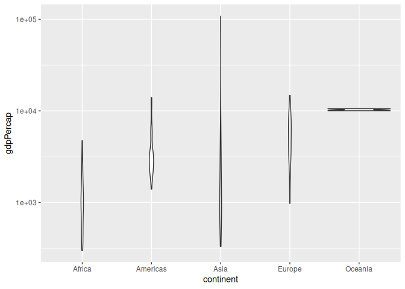
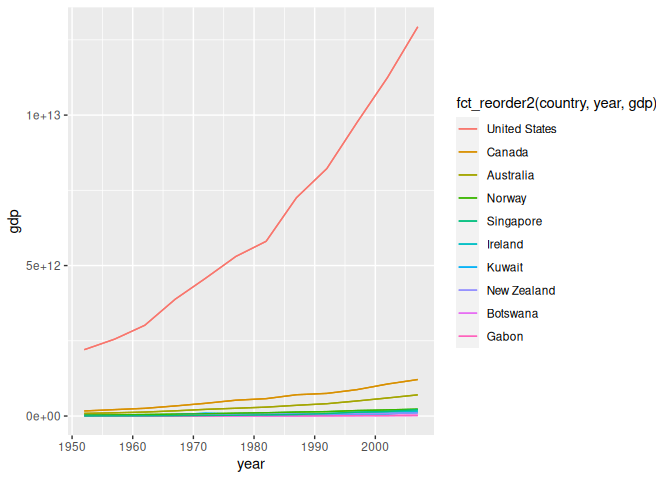

Gapminder
================
Andrew Mascillaro
2023-01-22

- <a href="#grading-rubric" id="toc-grading-rubric">Grading Rubric</a>
  - <a href="#individual" id="toc-individual">Individual</a>
  - <a href="#due-date" id="toc-due-date">Due Date</a>
- <a href="#guided-eda" id="toc-guided-eda">Guided EDA</a>
  - <a
    href="#q0-perform-your-first-checks-on-the-dataset-what-variables-are-in-this"
    id="toc-q0-perform-your-first-checks-on-the-dataset-what-variables-are-in-this"><strong>q0</strong>
    Perform your “first checks” on the dataset. What variables are in
    this</a>
  - <a
    href="#q1-determine-the-most-and-least-recent-years-in-the-gapminder-dataset"
    id="toc-q1-determine-the-most-and-least-recent-years-in-the-gapminder-dataset"><strong>q1</strong>
    Determine the most and least recent years in the <code>gapminder</code>
    dataset.</a>
  - <a
    href="#q2-filter-on-years-matching-year_min-and-make-a-plot-of-the-gdp-per-capita-against-continent-choose-an-appropriate-geom_-to-visualize-the-data-what-observations-can-you-make"
    id="toc-q2-filter-on-years-matching-year_min-and-make-a-plot-of-the-gdp-per-capita-against-continent-choose-an-appropriate-geom_-to-visualize-the-data-what-observations-can-you-make"><strong>q2</strong>
    Filter on years matching <code>year_min</code>, and make a plot of the
    GDP per capita against continent. Choose an appropriate
    <code>geom_</code> to visualize the data. What observations can you
    make?</a>
  - <a
    href="#q3-you-should-have-found-at-least-three-outliers-in-q2-but-possibly-many-more-identify-those-outliers-figure-out-which-countries-they-are"
    id="toc-q3-you-should-have-found-at-least-three-outliers-in-q2-but-possibly-many-more-identify-those-outliers-figure-out-which-countries-they-are"><strong>q3</strong>
    You should have found <em>at least</em> three outliers in q2 (but
    possibly many more!). Identify those outliers (figure out which
    countries they are).</a>
  - <a
    href="#q4-create-a-plot-similar-to-yours-from-q2-studying-both-year_min-and-year_max-find-a-way-to-highlight-the-outliers-from-q3-on-your-plot-in-a-way-that-lets-you-identify-which-country-is-which-compare-the-patterns-between-year_min-and-year_max"
    id="toc-q4-create-a-plot-similar-to-yours-from-q2-studying-both-year_min-and-year_max-find-a-way-to-highlight-the-outliers-from-q3-on-your-plot-in-a-way-that-lets-you-identify-which-country-is-which-compare-the-patterns-between-year_min-and-year_max"><strong>q4</strong>
    Create a plot similar to yours from q2 studying both
    <code>year_min</code> and <code>year_max</code>. Find a way to highlight
    the outliers from q3 on your plot <em>in a way that lets you identify
    which country is which</em>. Compare the patterns between
    <code>year_min</code> and <code>year_max</code>.</a>
- <a href="#your-own-eda" id="toc-your-own-eda">Your Own EDA</a>
  - <a
    href="#q5-create-at-least-three-new-figures-below-with-each-figure-try-to-pose-new-questions-about-the-data"
    id="toc-q5-create-at-least-three-new-figures-below-with-each-figure-try-to-pose-new-questions-about-the-data"><strong>q5</strong>
    Create <em>at least</em> three new figures below. With each figure, try
    to pose new questions about the data.</a>

*Purpose*: Learning to do EDA well takes practice! In this challenge
you’ll further practice EDA by first completing a guided exploration,
then by conducting your own investigation. This challenge will also give
you a chance to use the wide variety of visual tools we’ve been
learning.

<!-- include-rubric -->

# Grading Rubric

<!-- -------------------------------------------------- -->

Unlike exercises, **challenges will be graded**. The following rubrics
define how you will be graded, both on an individual and team basis.

## Individual

<!-- ------------------------- -->

| Category    | Needs Improvement                                                                                                | Satisfactory                                                                                                               |
|-------------|------------------------------------------------------------------------------------------------------------------|----------------------------------------------------------------------------------------------------------------------------|
| Effort      | Some task **q**’s left unattempted                                                                               | All task **q**’s attempted                                                                                                 |
| Observed    | Did not document observations, or observations incorrect                                                         | Documented correct observations based on analysis                                                                          |
| Supported   | Some observations not clearly supported by analysis                                                              | All observations clearly supported by analysis (table, graph, etc.)                                                        |
| Assessed    | Observations include claims not supported by the data, or reflect a level of certainty not warranted by the data | Observations are appropriately qualified by the quality & relevance of the data and (in)conclusiveness of the support      |
| Specified   | Uses the phrase “more data are necessary” without clarification                                                  | Any statement that “more data are necessary” specifies which *specific* data are needed to answer what *specific* question |
| Code Styled | Violations of the [style guide](https://style.tidyverse.org/) hinder readability                                 | Code sufficiently close to the [style guide](https://style.tidyverse.org/)                                                 |

## Due Date

<!-- ------------------------- -->

All the deliverables stated in the rubrics above are due **at midnight**
before the day of the class discussion of the challenge. See the
[Syllabus](https://docs.google.com/document/d/1qeP6DUS8Djq_A0HMllMqsSqX3a9dbcx1/edit?usp=sharing&ouid=110386251748498665069&rtpof=true&sd=true)
for more information.

``` r
library(tidyverse)
```

    ## ── Attaching packages ─────────────────────────────────────── tidyverse 1.3.2 ──
    ## ✔ ggplot2 3.4.0      ✔ purrr   1.0.1 
    ## ✔ tibble  3.1.8      ✔ dplyr   1.0.10
    ## ✔ tidyr   1.2.1      ✔ stringr 1.5.0 
    ## ✔ readr   2.1.3      ✔ forcats 0.5.2 
    ## ── Conflicts ────────────────────────────────────────── tidyverse_conflicts() ──
    ## ✖ dplyr::filter() masks stats::filter()
    ## ✖ dplyr::lag()    masks stats::lag()

``` r
library(gapminder)
```

*Background*: [Gapminder](https://www.gapminder.org/about-gapminder/) is
an independent organization that seeks to educate people about the state
of the world. They seek to counteract the worldview constructed by a
hype-driven media cycle, and promote a “fact-based worldview” by
focusing on data. The dataset we’ll study in this challenge is from
Gapminder.

# Guided EDA

<!-- -------------------------------------------------- -->

First, we’ll go through a round of *guided EDA*. Try to pay attention to
the high-level process we’re going through—after this guided round
you’ll be responsible for doing another cycle of EDA on your own!

### **q0** Perform your “first checks” on the dataset. What variables are in this

dataset?

``` r
gapminder %>% glimpse()
```

    ## Rows: 1,704
    ## Columns: 6
    ## $ country   <fct> "Afghanistan", "Afghanistan", "Afghanistan", "Afghanistan", …
    ## $ continent <fct> Asia, Asia, Asia, Asia, Asia, Asia, Asia, Asia, Asia, Asia, …
    ## $ year      <int> 1952, 1957, 1962, 1967, 1972, 1977, 1982, 1987, 1992, 1997, …
    ## $ lifeExp   <dbl> 28.801, 30.332, 31.997, 34.020, 36.088, 38.438, 39.854, 40.8…
    ## $ pop       <int> 8425333, 9240934, 10267083, 11537966, 13079460, 14880372, 12…
    ## $ gdpPercap <dbl> 779.4453, 820.8530, 853.1007, 836.1971, 739.9811, 786.1134, …

**Observations**:

- The variables include country, continent, year, lifeExp, pop, and
  gdpPercap

### **q1** Determine the most and least recent years in the `gapminder` dataset.

*Hint*: Use the `pull()` function to get a vector out of a tibble.
(Rather than the `$` notation of base R.)

``` r
## TASK: Find the largest and smallest values of `year` in `gapminder`
year_max <- gapminder %>% 
  pull(year) %>% 
  max()
year_min <- gapminder %>% 
  pull(year) %>% 
  min()
```

Use the following test to check your work.

``` r
## NOTE: No need to change this
assertthat::assert_that(year_max %% 7 == 5)
```

    ## [1] TRUE

``` r
assertthat::assert_that(year_max %% 3 == 0)
```

    ## [1] TRUE

``` r
assertthat::assert_that(year_min %% 7 == 6)
```

    ## [1] TRUE

``` r
assertthat::assert_that(year_min %% 3 == 2)
```

    ## [1] TRUE

``` r
if (is_tibble(year_max)) {
  print("year_max is a tibble; try using `pull()` to get a vector")
  assertthat::assert_that(False)
}

print("Nice!")
```

    ## [1] "Nice!"

### **q2** Filter on years matching `year_min`, and make a plot of the GDP per capita against continent. Choose an appropriate `geom_` to visualize the data. What observations can you make?

You may encounter difficulties in visualizing these data; if so document
your challenges and attempt to produce the most informative visual you
can.

``` r
gapminder %>% 
  filter(year == year_min) %>% 
  ggplot(aes(x = continent, y = gdpPercap)) +
  geom_violin()
```

<!-- -->

``` r
gapminder %>% 
  filter(year == year_min) %>% 
  ggplot(aes(x = continent, y = gdpPercap)) +
  geom_boxplot()
```

<!-- -->

**Observations**:

- GDP per capita within a continent is very right skewed.

**Difficulties & Approaches**:

- It’s difficult to visualize the distribution of GDP per capita with
  outliers that are so much larger than nearby countries.
- Originally I attempted to use a scatterplot but the points were too
  cluttered.
- Then, I tried a box plot, although the outliers made the graph so
  zoomed out that the distribution of GDP per capita within a continent
  was hard to observe.
- As a result, I used a violin plot to show distribution. The box plot
  is still shown to help find outliers in the next question.

### **q3** You should have found *at least* three outliers in q2 (but possibly many more!). Identify those outliers (figure out which countries they are).

``` r
gapminder %>% 
  filter(year == year_min) %>% 
  arrange(desc(gdpPercap)) %>% 
  group_by(continent) %>% 
  slice(1:3)
```

    ## # A tibble: 14 × 6
    ## # Groups:   continent [5]
    ##    country        continent  year lifeExp       pop gdpPercap
    ##    <fct>          <fct>     <int>   <dbl>     <int>     <dbl>
    ##  1 South Africa   Africa     1952    45.0  14264935     4725.
    ##  2 Gabon          Africa     1952    37.0    420702     4293.
    ##  3 Angola         Africa     1952    30.0   4232095     3521.
    ##  4 United States  Americas   1952    68.4 157553000    13990.
    ##  5 Canada         Americas   1952    68.8  14785584    11367.
    ##  6 Venezuela      Americas   1952    55.1   5439568     7690.
    ##  7 Kuwait         Asia       1952    55.6    160000   108382.
    ##  8 Bahrain        Asia       1952    50.9    120447     9867.
    ##  9 Saudi Arabia   Asia       1952    39.9   4005677     6460.
    ## 10 Switzerland    Europe     1952    69.6   4815000    14734.
    ## 11 Norway         Europe     1952    72.7   3327728    10095.
    ## 12 United Kingdom Europe     1952    69.2  50430000     9980.
    ## 13 New Zealand    Oceania    1952    69.4   1994794    10557.
    ## 14 Australia      Oceania    1952    69.1   8691212    10040.

**Observations**:

- Identify the outlier countries from q2
  - The top 2 countries in Africa, top 3 countries in the Americas, top
    2 countries in Asia, and top country in Europe are outliers.
  - That includes South Africa, Gabon, the United States, Canada,
    Venezuela, Kuwait, Bahrain, and Switzerland.

*Hint*: For the next task, it’s helpful to know a ggplot trick we’ll
learn in an upcoming exercise: You can use the `data` argument inside
any `geom_*` to modify the data that will be plotted *by that geom
only*. For instance, you can use this trick to filter a set of points to
label:

``` r
## NOTE: No need to edit, use ideas from this in q4 below
gapminder %>%
  filter(year == max(year)) %>%

  ggplot(aes(continent, lifeExp)) +
  geom_boxplot() +
  geom_point(
    data = . %>% filter(country %in% c("United Kingdom", "Japan", "Zambia")),
    mapping = aes(color = country),
    size = 2
  )
```

<!-- -->

### **q4** Create a plot similar to yours from q2 studying both `year_min` and `year_max`. Find a way to highlight the outliers from q3 on your plot *in a way that lets you identify which country is which*. Compare the patterns between `year_min` and `year_max`.

*Hint*: We’ve learned a lot of different ways to show multiple
variables; think about using different aesthetics or facets.

``` r
gapminder %>%
  filter(year == year_min | year == year_max) %>% 
  ggplot(aes(x = continent, y = gdpPercap)) +
  geom_violin() +
  geom_point(
    data = . %>% filter(country %in% c("South Africa", "Gabon", "United States",
                                       "Canada", "Venezuela", "Kuwait", "Bahrain",
                                       "Switzerland")),
    mapping = aes(color = country),
    size = 2
  ) +
  facet_wrap(~year)
```

<!-- -->

**Observations**:

- The outlier countries in 1952 are all still above average in their
  countries today, which I found surprising because I expected at least
  one of the countries to be unstable (as a few have rather unstable
  economies like Kuwait).
- Apart from Kuwait, the outliers in gdp per capita are more apparent
  in 2007. In other words, the income gap (or difference in average
  wealth) is greater in 2007 than in 1952.

# Your Own EDA

<!-- -------------------------------------------------- -->

Now it’s your turn! We just went through guided EDA considering the GDP
per capita at two time points. You can continue looking at outliers,
consider different years, repeat the exercise with `lifeExp`, consider
the relationship between variables, or something else entirely.

### **q5** Create *at least* three new figures below. With each figure, try to pose new questions about the data.

``` r
top_countries <- gapminder %>% 
  filter(year == year_max) %>% 
  arrange(desc(gdpPercap)) %>% 
  group_by(continent) %>% 
  slice(1:2) %>% 
  pull(country)
df_q5 <- gapminder %>% 
  filter(country %in% top_countries)
df_q5
```

    ## # A tibble: 120 × 6
    ##    country   continent  year lifeExp      pop gdpPercap
    ##    <fct>     <fct>     <int>   <dbl>    <int>     <dbl>
    ##  1 Australia Oceania    1952    69.1  8691212    10040.
    ##  2 Australia Oceania    1957    70.3  9712569    10950.
    ##  3 Australia Oceania    1962    70.9 10794968    12217.
    ##  4 Australia Oceania    1967    71.1 11872264    14526.
    ##  5 Australia Oceania    1972    71.9 13177000    16789.
    ##  6 Australia Oceania    1977    73.5 14074100    18334.
    ##  7 Australia Oceania    1982    74.7 15184200    19477.
    ##  8 Australia Oceania    1987    76.3 16257249    21889.
    ##  9 Australia Oceania    1992    77.6 17481977    23425.
    ## 10 Australia Oceania    1997    78.8 18565243    26998.
    ## # … with 110 more rows

``` r
df_q5 %>% 
  ggplot(aes(x = year, y = gdpPercap)) +
  geom_line(aes(color = country))
```

<!-- -->

- The GDP per capita of the top countries slowly rose over time, at
  least except for Kuwait.
- These lines all look similar, but how does the overall gdp compare?
  What if we compared GDP instead of GDP per capita?

``` r
df_q5 %>%
  mutate(gdp = gdpPercap * pop) %>% 
  ggplot(aes(x = year, y = gdp)) +
  geom_line(aes(color = country))
```

<!-- -->

- Wow, Australia has the highest GDP by far of all of these countries.
  If we use a logarithmic y axis can we draw more conclusions about the
  other countries?

``` r
df_q5 %>%
  mutate(gdp = gdpPercap * pop) %>%
  ggplot(aes(x = year, y = gdp)) +
  geom_line(aes(color = country)) +
  scale_y_continuous(trans = 'log10')
```

<!-- -->

- The lines in these graphs appear linear, which indicates exponential
  growth in GDP for the richest countries in each continent.
