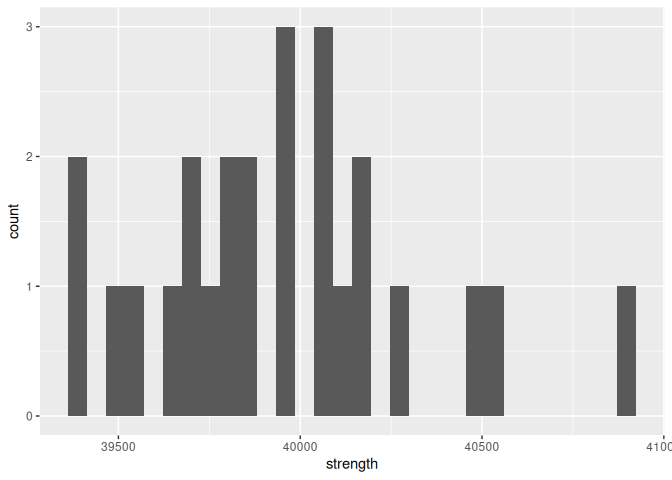

Structural Safety
================
Andrew Mascillaro
2023-03-14

- [Grading Rubric](#grading-rubric)
  - [Individual](#individual)
  - [Due Date](#due-date)
- [Setup](#setup)
  - [**q1** Visualize the strength data with a histogram. Answer the
    questions
    below.](#q1-visualize-the-strength-data-with-a-histogram-answer-the-questions-below)
- [Assessing Structural Safety](#assessing-structural-safety)
  - [Structural model](#structural-model)
    - [**q2** Using the observations in `df_samples` and the structural
      model `g_break()`, estimate the probability of
      failure.](#q2-using-the-observations-in-df_samples-and-the-structural-model-g_break-estimate-the-probability-of-failure)
  - [Material property model](#material-property-model)
    - [**q3** Fit a lognormal distribution to the strength data using
      the `fitdistr()`
      function.](#q3-fit-a-lognormal-distribution-to-the-strength-data-using-the-fitdistr-function)
    - [**q4** Complete the code below by 1. choosing a Monte Carlo
      sample size `n_monte_carlo`, 2. extracting the estimated
      parameters from q3, and 3. computing the limit state value
      `g = g_break()`. Answer the questions under *observations*
      below.](#q4-complete-the-code-below-by-1-choosing-a-monte-carlo-sample-size-n_monte_carlo-2-extracting-the-estimated-parameters-from-q3-and-3-computing-the-limit-state-value-g--g_break-answer-the-questions-under-observations-below)
  - [A different way to compute the
    POF](#a-different-way-to-compute-the-pof)
    - [**q5** Finish the following function by computing the POF with
      `plnorm()`. Answer the questions under *observations*
      below.](#q5-finish-the-following-function-by-computing-the-pof-with-plnorm-answer-the-questions-under-observations-below)
  - [Quantifying sampling
    uncertainty](#quantifying-sampling-uncertainty)
    - [**q6** The code below estimates a bootstrap CI on your POF
      estimate. Answer the questions under *observations*
      below.](#q6-the-code-below-estimates-a-bootstrap-ci-on-your-pof-estimate-answer-the-questions-under-observations-below)

*Purpose*: Most real problems have multiple sources of uncertainty mixed
together. Untangling these different sources can be challenging, even on
a conceptual level. In this challenge we’ll study a simple problem of
structural safety, and use this small case study to untangle sources of
sampling and Monte Carlo uncertainty.

*Note*: In this challenge I provide a lot of stub-code; you won’t have
to do too much coding. This is because I want you to *focus on answering
the conceptual questions*. The most important questions in this
challenge are: *What sources of uncertainty are you accounting for? What
sources are you not accounting for? Are those sources real or induced?*

<!-- include-rubric -->

# Grading Rubric

<!-- -------------------------------------------------- -->

Unlike exercises, **challenges will be graded**. The following rubrics
define how you will be graded, both on an individual and team basis.

## Individual

<!-- ------------------------- -->

| Category    | Needs Improvement                                                                                                | Satisfactory                                                                                                               |
|-------------|------------------------------------------------------------------------------------------------------------------|----------------------------------------------------------------------------------------------------------------------------|
| Effort      | Some task **q**’s left unattempted                                                                               | All task **q**’s attempted                                                                                                 |
| Observed    | Did not document observations, or observations incorrect                                                         | Documented correct observations based on analysis                                                                          |
| Supported   | Some observations not clearly supported by analysis                                                              | All observations clearly supported by analysis (table, graph, etc.)                                                        |
| Assessed    | Observations include claims not supported by the data, or reflect a level of certainty not warranted by the data | Observations are appropriately qualified by the quality & relevance of the data and (in)conclusiveness of the support      |
| Specified   | Uses the phrase “more data are necessary” without clarification                                                  | Any statement that “more data are necessary” specifies which *specific* data are needed to answer what *specific* question |
| Code Styled | Violations of the [style guide](https://style.tidyverse.org/) hinder readability                                 | Code sufficiently close to the [style guide](https://style.tidyverse.org/)                                                 |

## Due Date

<!-- ------------------------- -->

All the deliverables stated in the rubrics above are due **at midnight**
before the day of the class discussion of the challenge. See the
[Syllabus](https://docs.google.com/document/d/1qeP6DUS8Djq_A0HMllMqsSqX3a9dbcx1/edit?usp=sharing&ouid=110386251748498665069&rtpof=true&sd=true)
for more information.

# Setup

<!-- ----------------------------------------------------------------------- -->

``` r
library(MASS)
library(rsample)
library(broom)
library(tidyverse)
```

    ## ── Attaching core tidyverse packages ──────────────────────── tidyverse 2.0.0 ──
    ## ✔ dplyr     1.1.2     ✔ readr     2.1.4
    ## ✔ forcats   1.0.0     ✔ stringr   1.5.0
    ## ✔ ggplot2   3.4.2     ✔ tibble    3.2.1
    ## ✔ lubridate 1.9.2     ✔ tidyr     1.3.0
    ## ✔ purrr     1.0.1     
    ## ── Conflicts ────────────────────────────────────────── tidyverse_conflicts() ──
    ## ✖ dplyr::filter() masks stats::filter()
    ## ✖ dplyr::lag()    masks stats::lag()
    ## ✖ dplyr::select() masks MASS::select()
    ## ℹ Use the conflicted package (<http://conflicted.r-lib.org/>) to force all conflicts to become errors

``` r
filename_samples <- "./data/al_samples.csv"
```

*Background*: The
[strength](https://en.wikipedia.org/wiki/Ultimate_tensile_strength) of a
material is the amount of mechanical stress it can survive before
breaking. To illustrate: Stresses are internal forces that hold an
object together when we try to squeeze, stretch, or otherwise deform a
solid object. For instance, if we pull on a rectangular bar of material,
internal stresses $\sigma$ work to keep the bar together.

<figure>

<figcaption aria-hidden="true">Stress</figcaption>
</figure>

By Jorge Stolfi - Own work, CC BY-SA 3.0,
<https://commons.wikimedia.org/w/index.php?curid=24499456>

*Strength* is a measure of how much internal stress an object can
survive: A higher strength means a stronger material. This challenge’s
data are very simple: They are (synthetic) observations of ultimate
tensile strength (UTS) on individual samples of the same aluminum alloy.
The experiments were carried out following the higest standards of
experimental rigor, so you should consider these values to be the “true”
breaking strength for each sample.

``` r
## NOTE: No need to edit; load data
df_samples <- read_csv(filename_samples)
```

    ## Rows: 25 Columns: 1
    ## ── Column specification ────────────────────────────────────────────────────────
    ## Delimiter: ","
    ## dbl (1): strength
    ## 
    ## ℹ Use `spec()` to retrieve the full column specification for this data.
    ## ℹ Specify the column types or set `show_col_types = FALSE` to quiet this message.

``` r
df_samples
```

    ## # A tibble: 25 × 1
    ##    strength
    ##       <dbl>
    ##  1   39484.
    ##  2   39812.
    ##  3   40052.
    ##  4   40519.
    ##  5   40045.
    ##  6   40160.
    ##  7   40094.
    ##  8   39674.
    ##  9   40144.
    ## 10   39865.
    ## # ℹ 15 more rows

Data Dictionary:

| Quantity       | Units |
|----------------|-------|
| Strength (UTS) | psi   |

### **q1** Visualize the strength data with a histogram. Answer the questions below.

``` r
df_samples %>% 
  ggplot(aes(x=strength)) +
  geom_histogram()
```

    ## `stat_bin()` using `bins = 30`. Pick better value with `binwidth`.

<!-- -->

**Observations**:

- What is the mean strength of the material, approximately?
  - The mean strength is roughly 40000 psi.
- To what extent can you tell what shape the distribution of the data
  has?
  - I can get a rough shape, but not enough to know if it’s normally
    distributed or right-skewed.
- Assuming the scopus is the strength of an individual part made from
  this aluminum alloy, is the observed variability real or induced?
  - The observed variability in this case would be both. Since there is
    actual variability from part to part and induced error in measuring
    test samples, the variability has real and induced components.

# Assessing Structural Safety

<!-- ----------------------------------------------------------------------- -->

*Objective*: In this challenge you are going to study a structure and
assess its *probability of failure* (POF). A higher POF corresponds to a
more unsafe structure. Ultimately, we want

$$\text{POF} < 0.03.$$

Your job is to assess a given structure using the data provided and
determine whether you can *confidently* conclude that `POF < 0.03`.

## Structural model

<!-- --------------------------------------- -->

The following code chunk sets up a structural model: We are considering
a rectangular bar under uniaxial tensile load (as pictured above). A
larger cross-sectional area `A` is capable of surviving a greater load
`L`, but a larger `A` is a heavier (more expensive) structure. The
internal stress is approximately `sigma = L / A`—we simply compare this
quantity against the strength.

I pick particular values for `A, L` and package all the information in
the *limit state function* `g_break`:

``` r
## NOTE: No need to edit; model setup
A <- 0.0255 # Cross-sectional area
L <- 1000 # Applied load (lbs)

g_break <- function(strength) {
  strength - L / A
}
```

The *probability of failure* (POF) is then defined in terms of the limit
state $g$ via:

$$\text{POF} \equiv \mathbb{P}[g \leq 0].$$

### **q2** Using the observations in `df_samples` and the structural model `g_break()`, estimate the probability of failure.

*Hint*: In `c07-monte-carlo` you learned how to estimate a probability
as the `mean()` of an indicator. Use the same strategy here.

``` r
## TODO: Estimate the probability of failure; i.e. POF = Pr[g <= 0]
df_samples %>% 
  mutate(
    is_broken = map_dbl(strength, g_break) <= 0
  ) %>% 
  summarize(
    perc_broken = mean(is_broken)
  )
```

    ## # A tibble: 1 × 1
    ##   perc_broken
    ##         <dbl>
    ## 1           0

**Observations**:

- Does this estimate satisfy `POF < 0.03`?
  - This satisfies the condition as POF = 0.
- Is this estimate of the probability of failure trustworthy? Why or why
  not?
  - No, because it isn’t a representative sample of the entire
    distribution of possible pieces of aluminum rods, and the
    distribution can’t be known from this simplification of the data
    (binary classification of pass or fail).
- Can you confidently conclude that `POF < 0.03`? Why or why not.
  - Not necessarily, as there were only 25 samples. Consider that only
    1.5 samples need to break to disprove this, and that’s linearly very
    close to 0

## Material property model

<!-- --------------------------------------- -->

Since we have so few physical samples, we will fit a distribution to
model the material property. This will give us the means to draw
“virtual samples” and use those to estimate the POF.

### **q3** Fit a lognormal distribution to the strength data using the `fitdistr()` function.

*Note*: In this challenge I generated the `strength` data from a
`lognormal` distribution; if you didn’t know that fact, then the choice
of distribution would be an *additional* source of uncertainty!

*Hint 1*: We learned how to do this in `e-stat08-fit-dist`.

*Hint 2*: The `fitdistr` function uses `densfun = "lognormal"` to
specify a lognormal distribution.

``` r
## TODO:
df_fit <- df_samples %>% 
  pull(strength) %>% 
  fitdistr(densfun="lognormal") %>% 
  tidy()
df_fit
```

    ## # A tibble: 2 × 3
    ##   term    estimate std.error
    ##   <chr>      <dbl>     <dbl>
    ## 1 meanlog 10.6       0.00175
    ## 2 sdlog    0.00875   0.00124

Once you’ve successfully fit a model for the strength, you can estimate
the probability of failure by drawing samples from the fitted
distribution.

### **q4** Complete the code below by 1. choosing a Monte Carlo sample size `n_monte_carlo`, 2. extracting the estimated parameters from q3, and 3. computing the limit state value `g = g_break()`. Answer the questions under *observations* below.

*Hint 1*: You will need to combine ideas from `c07-monte-carlo` and
`e-stat08-fit-dist` in order to complete this task.

*Hint 2*: The function `rlnorm()` will allow you to draw samples from a
lognormal distribution.

``` r
## TODO 1: Choose Monte Carlo sample size
n_monte_carlo <- 1000

## TODO 2: Extract parameter estimates from df_fit
strength_meanlog <- df_fit$estimate[[1]]
strength_sdlog <- df_fit$estimate[[2]]

# Generate samples
set.seed(19091)
df_norm_sim <-
  tibble(strength = rlnorm(n_monte_carlo, strength_meanlog, strength_sdlog)) %>%
  mutate(
    g = map_dbl(strength, g_break)
  ) %>% 
## TODO 3: Compute structural response
  mutate(stat = g <= 0) %>%
  glimpse()
```

    ## Rows: 1,000
    ## Columns: 3
    ## $ strength <dbl> 38935.92, 40191.59, 39689.95, 39324.39, 39727.47, 39642.46, 4…
    ## $ g        <dbl> -279.76601, 975.90561, 474.26004, 108.70516, 511.78593, 426.7…
    ## $ stat     <lgl> TRUE, FALSE, FALSE, FALSE, FALSE, FALSE, FALSE, FALSE, FALSE,…

``` r
## NOTE: The following code estimates the POF and a 95% confidence interval
df_norm_pof <-
  df_norm_sim %>%
  summarize(
    pof_est = mean(stat),
    se = sd(stat) / sqrt(n_monte_carlo)
  ) %>%
  mutate(
    pof_lo = pof_est - 1.96 * se,
    pof_hi = pof_est + 1.96 * se
  ) %>%
  select(pof_lo, pof_est, pof_hi)

df_norm_pof
```

    ## # A tibble: 1 × 3
    ##    pof_lo pof_est pof_hi
    ##     <dbl>   <dbl>  <dbl>
    ## 1 0.00746   0.015 0.0225

- Assuming your scopus is the probability of failure `POF` defined
  above, does your estimate exhibit real variability, induced
  variability, or both?
  - My estimate exhibits real variability when observing the
    distribution of strengths of different parts
- Does this confidence interval imply that `POF < 0.03`?
  - Because the confidence interval is fully in the range of
    `POF < 0.03` (the high is about `0.023`), the data do suggest that
    the probability of failure is lower than `0.03`.
- Compare this probability with your estimate from q2; is it more or
  less trustworthy?
  - This is more trustworthy because an answer of zero doesn’t have any
    confidence or other estimate of uncertainty associated with it,
    making it a less reliable datapoint on its own
- Does the confidence interval above account for uncertainty arising
  from the *Monte Carlo approximation*? Why or why not?
  - The confidence interval does not account for uncertainty arising
    from the Monte Carlo approximation because it assumes that the Monte
    Carlo approximation is a valid approximation without sufficiently
    proving this. Additionally, different random samples in a Monte
    Carlo approximation can make different confidence intervals, and
    this confidence interval doesn’t take that into account.
- Does the confidence interval above account for uncertainty arising
  from *limited physical tests* (`df_samples`)? Why or why not?
  - No, this confidence interval does not account for uncertainty
    arising from limited physical tests as the integrity of the
    simulated data hinges on the physical tests being an accurate
    representation of the population
- What could you do to tighten up the confidence interval?
  - Increasing the sample size of simulated points would tighten the
    confidence interval. Ideally, getting a confidence interval using a
    cdf of the lognormal distribution would be the most “correct”
    confidence interval instead of doing a Monte Carlo approximation of
    the lognormal distribution.
- Can you *confidently* conclude that `POF < 0.03`? Why or why not?
  - Some might argue that I cannot due to other factors influencing this
    approximation, but if I knew more about the processes involved in
    testing the samples I would not be opposed to concluding this. If I
    can be convinced that induced error would only result in
    artificially lower measurements of strength and if I did a more
    thorough analysis of parts in general that convinced me that
    strength tests like this follow a lognormal distribution, I would
    conclude that `POF < 0.03`.

## A different way to compute the POF

<!-- --------------------------------------- -->

Monte Carlo is a *general* way to estimate probabilities, but it
introduces approximation error. It turns out that, for the simple
problem we’re studying, we can compute the probability directly using
the CDF. Note that for our structural safety problem, we have

$$\text{POF} = \mathbb{P}[g \leq 0] = \mathbb{P}[S \leq L / A] = \text{CDF}_S(L/A).$$

Since
`S = rlnorm(n, meanlog = strength_meanlog, sdlog = strength_sdlog)`, we
can use `plnorm` to compute the probability of failure without Monte
Carlo as
`POF = plnorm(L/A, meanlog = strength_meanlog, sdlog = strength_sdlog)`.
Let’s combine this idea with the fitted distribution to estimate the
POF.

### **q5** Finish the following function by computing the POF with `plnorm()`. Answer the questions under *observations* below.

``` r
## TODO: Complete the function below;
##       note that you only need to edit the TODO section

estimate_pof <- function(df) {
  ## Fit the distribution
  df_fit <-
    df %>%
    pull(strength) %>%
    fitdistr(densfun = "lognormal") %>%
    tidy()

  ## Extract the parameters
  strength_meanlog <-
    df_fit %>%
    filter(term == "meanlog") %>%
    pull(estimate)
  strength_sdlog <-
    df_fit %>%
    filter(term == "sdlog") %>%
    pull(estimate)

## TODO: Estimate the probability of failure using plnorm
  pof_estimate <- plnorm(
    L / A,
    meanlog = strength_meanlog,
    sdlog = strength_sdlog
  )

  ## NOTE: No need to edit; this last line returns your pof_estimate
  pof_estimate
}

## NOTE: No need to edit; test your function
df_samples %>% estimate_pof()
```

    ## [1] 0.01832289

**Observations**:

- How does this estimate compare with your Monte Carlo estimate above?
  - This POF is within the confidence interval of the Monte Carlo
    estimate but higher than the mean estimate from the sample.
- Does this estimate have any uncertainty due to *Monte Carlo
  approximation*? Why or why not?
  - This does not because there is no Monte Carlo approximation.
- With the scopus as the `POF`, would uncertainty due to *Monte Carlo
  approximation* be induced or real?
  - The uncertainty would be induced.
- Does this estimate have any uncertainty due to *limited physical
  tests*? Why or why not?
  - Yes because the lognormal model is still made from the limited
    physical test data.
- With the scopus as the `POF`, would uncertainty due to *limited
  physical tests* be induced or real?
  - This uncertainty would be real because physical tests can have real
    error due to their manufacturing processes and we can assume minimal
    to no induced error because of the testing procedures.

## Quantifying sampling uncertainty

<!-- --------------------------------------- -->

Using `plnorm()` gets rid of Monte Carlo error, but we still have
uncertainty due to limited physical testing. Often we can use a CLT
approximation to construct a confidence interval. However, with
`plnorm()` we can’t use a CLT approximation because it does not follow
the assumptions of the central limit theorem (it’s not a sum of iid
random variables). Instead, we can use the *bootstrap* to approximate a
confidence interval via resampling.

### **q6** The code below estimates a bootstrap CI on your POF estimate. Answer the questions under *observations* below.

``` r
## NOTE: No need to edit; run and inspect
set.seed(strtoi("zdr", base = 36))
tidycustom <- function(est) {tibble(term = "pof", estimate = est)}

df_samples %>%
  bootstraps(times = 1000) %>%
  mutate(
    estimates = map(
      splits,
      ~ analysis(.x) %>% estimate_pof() %>% tidycustom()
    )
  ) %>%
  int_pctl(estimates)
```

    ## # A tibble: 1 × 6
    ##   term   .lower .estimate .upper .alpha .method   
    ##   <chr>   <dbl>     <dbl>  <dbl>  <dbl> <chr>     
    ## 1 pof   0.00104    0.0174 0.0489   0.05 percentile

**Observations**:

- Does the confidence interval above account for uncertainty arising
  from *Monte Carlo approximation* of the POF? Why or why not?
  - It accounts for it by taking a ton of samples
- Does the confidence interval above account for uncertainty arising
  from *limited physical tests* (`df_samples`)? Why or why not?
  - No because nothing using `df_samples` can without more/better data.
- Can you confidently conclude that `POF < 0.03`? Why or why not?
  - No because the upper bound of this confidence interval is higher
    than 0.03.
