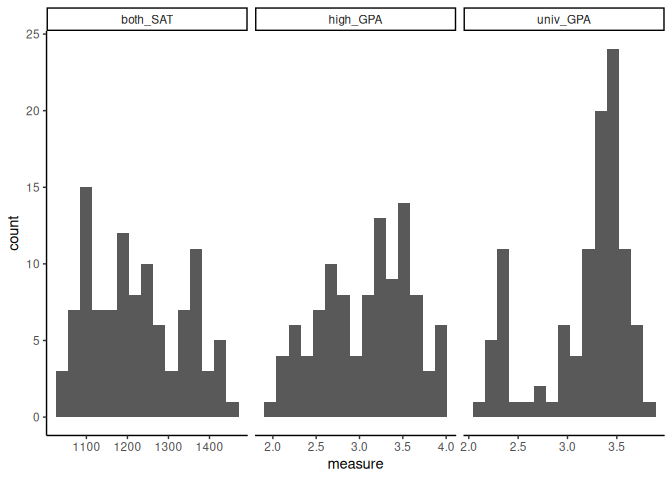

SAT and College Grades
================
(Your name here)
2020-

- [Grading Rubric](#grading-rubric)
  - [Individual](#individual)
  - [Due Date](#due-date)
- [Obtain the Data](#obtain-the-data)
  - [**q1** Visit the SAT and College GPA case study page, scroll to the
    bottom, and click the `Open Data with Excel` button. This will allow
    you to download an `xls` file. Save the file to your `data` folder,
    load the data as `df_sat`, and perform your “first checks” against
    these data. Answer the questions
    below:](#q1-visit-the-sat-and-college-gpa-case-study-page-scroll-to-the-bottom-and-click-the-open-data-with-excel-button-this-will-allow-you-to-download-an-xls-file-save-the-file-to-your-data-folder-load-the-data-as-df_sat-and-perform-your-first-checks-against-these-data-answer-the-questions-below)
- [Analysis with Hypothesis Testing](#analysis-with-hypothesis-testing)
  - [View 1: Correlations](#view-1-correlations)
    - [**q2** Create a *single* plot that shows `univ_GPA` against
      *both* `high_GPA` and `both_SAT`. Visually compare the two
      trends.](#q2-create-a-single-plot-that-shows-univ_gpa-against-both-high_gpa-and-both_sat-visually-compare-the-two-trends)
    - [Hypothesis Testing with a Correlation
      Coefficient](#hypothesis-testing-with-a-correlation-coefficient)
    - [**q3** Plot histograms for `both_SAT, high_GPA, univ_GPA`.
      Which—if any—of the variables look approximately normally
      distributed.](#q3-plot-histograms-for-both_sat-high_gpa-univ_gpa-whichif-anyof-the-variables-look-approximately-normally-distributed)
    - [**q4** Use the function `cor.test()` to construct confidence
      intervals for `corr[high_GPA, univ_GPA]` and
      `corr[both_SAT, univ_GPA]`. Answer the questions
      below.](#q4-use-the-function-cortest-to-construct-confidence-intervals-for-corrhigh_gpa-univ_gpa-and-corrboth_sat-univ_gpa-answer-the-questions-below)
    - [**q5** Use the bootstrap to approximate a confidence interval for
      `corr[high_GPA, univ_GPA`. Compare your results—both the estimate
      and confidence interval—to your results from
      q4.](#q5-use-the-bootstrap-to-approximate-a-confidence-interval-for-corrhigh_gpa-univ_gpa-compare-your-resultsboth-the-estimate-and-confidence-intervalto-your-results-from-q4)
  - [View 2: Modeling](#view-2-modeling)
    - [Hypothesis Testing with a
      Model](#hypothesis-testing-with-a-model)
    - [**q6** Fit a linear model predicting `univ_GPA` with the
      predictor `both_SAT`. Assess the model to determine how effective
      a predictor `both_SAT` is for `univ_GPA`. Interpret the resulting
      confidence interval for the coefficient on
      `both_SAT`.](#q6-fit-a-linear-model-predicting-univ_gpa-with-the-predictor-both_sat-assess-the-model-to-determine-how-effective-a-predictor-both_sat-is-for-univ_gpa-interpret-the-resulting-confidence-interval-for-the-coefficient-on-both_sat)
    - [**q7** Fit a model predicting `univ_GPA` using both `high_GPA`
      and `both_SAT`. Compare the prediction accuracy and hypothesis
      test
      results.](#q7-fit-a-model-predicting-univ_gpa-using-both-high_gpa-and-both_sat-compare-the-prediction-accuracy-and-hypothesis-test-results)
  - [Synthesize](#synthesize)
    - [**q8** Using the results from all previous q’s, answer the
      following
      questions.](#q8-using-the-results-from-all-previous-qs-answer-the-following-questions)
- [End Notes](#end-notes)

*Purpose*: How do we apply hypothesis testing to investigating data? In
this challenge you’ll practice using hypothesis testing tools to make
sense of a dataset.

*Reading*: - [Harvard Study Says SATs Should Be Optional: Here’s
Why](https://www.csmonitor.com/USA/USA-Update/2016/0120/Harvard-study-says-SATs-should-be-optional.-Here-s-why)
(Optional); easy-to-read news article on colleges going SAT-free -
[Norm-Referenced Tests and Race-Blind
Admissions](https://cshe.berkeley.edu/publications/norm-referenced-tests-and-race-blind-admissions-case-eliminating-sat-and-act-university)
(Optional); technical report on relationship between the SAT/ACT and
non-academic factors

*Credit*: This is based on a [case
study](http://onlinestatbook.com/2/case_studies/sat.html) originally
prepared by Emily Zitek, with data collected through the research of
Thomas MacFarland.

``` r
library(tidyverse)
```

    ## ── Attaching packages ─────────────────────────────────────── tidyverse 1.3.2 ──
    ## ✔ ggplot2 3.4.0      ✔ purrr   1.0.1 
    ## ✔ tibble  3.1.8      ✔ dplyr   1.0.10
    ## ✔ tidyr   1.2.1      ✔ stringr 1.5.0 
    ## ✔ readr   2.1.3      ✔ forcats 0.5.2 
    ## ── Conflicts ────────────────────────────────────────── tidyverse_conflicts() ──
    ## ✖ dplyr::filter() masks stats::filter()
    ## ✖ dplyr::lag()    masks stats::lag()

``` r
library(readxl)
library(broom)
library(modelr)
```

    ## 
    ## Attaching package: 'modelr'
    ## 
    ## The following object is masked from 'package:broom':
    ## 
    ##     bootstrap

``` r
library(rsample)
library(MASS)
```

    ## 
    ## Attaching package: 'MASS'
    ## 
    ## The following object is masked from 'package:dplyr':
    ## 
    ##     select

<!-- include-rubric -->

# Grading Rubric

<!-- -------------------------------------------------- -->

Unlike exercises, **challenges will be graded**. The following rubrics
define how you will be graded, both on an individual and team basis.

## Individual

<!-- ------------------------- -->

| Category    | Needs Improvement                                                                                                | Satisfactory                                                                                                               |
|-------------|------------------------------------------------------------------------------------------------------------------|----------------------------------------------------------------------------------------------------------------------------|
| Effort      | Some task **q**’s left unattempted                                                                               | All task **q**’s attempted                                                                                                 |
| Observed    | Did not document observations, or observations incorrect                                                         | Documented correct observations based on analysis                                                                          |
| Supported   | Some observations not clearly supported by analysis                                                              | All observations clearly supported by analysis (table, graph, etc.)                                                        |
| Assessed    | Observations include claims not supported by the data, or reflect a level of certainty not warranted by the data | Observations are appropriately qualified by the quality & relevance of the data and (in)conclusiveness of the support      |
| Specified   | Uses the phrase “more data are necessary” without clarification                                                  | Any statement that “more data are necessary” specifies which *specific* data are needed to answer what *specific* question |
| Code Styled | Violations of the [style guide](https://style.tidyverse.org/) hinder readability                                 | Code sufficiently close to the [style guide](https://style.tidyverse.org/)                                                 |

## Due Date

<!-- ------------------------- -->

All the deliverables stated in the rubrics above are due **at midnight**
before the day of the class discussion of the challenge. See the
[Syllabus](https://docs.google.com/document/d/1qeP6DUS8Djq_A0HMllMqsSqX3a9dbcx1/edit?usp=sharing&ouid=110386251748498665069&rtpof=true&sd=true)
for more information.

*Background*: Every year about 2 million students take the Scholastic
Aptitude Test (SAT). The exam is
[controversial](http://www.nea.org/home/73288.htm) but [extremely
consequential](https://www.csmonitor.com/2004/0518/p13s01-legn.html).
There are many claims about the SAT, but we’re going to look at just
one: Is the SAT predictive of scholastic performance in college? It
turns out this is a fairly complicated question to assess—we’ll get an
introduction to some of the complexities.

# Obtain the Data

<!-- -------------------------------------------------- -->

### **q1** Visit the [SAT and College GPA](http://onlinestatbook.com/2/case_studies/sat.html) case study page, scroll to the bottom, and click the `Open Data with Excel` button. This will allow you to download an `xls` file. Save the file to your `data` folder, load the data as `df_sat`, and perform your “first checks” against these data. Answer the questions below:

``` r
## TODO:
df_sat <- read_excel("data/sat.xls")

## TODO: Do your "first checks"
df_sat %>% glimpse()
```

    ## Rows: 105
    ## Columns: 5
    ## $ high_GPA <dbl> 3.45, 2.78, 2.52, 3.67, 3.24, 2.10, 2.82, 2.36, 2.42, 3.51, 3…
    ## $ math_SAT <dbl> 643, 558, 583, 685, 592, 562, 573, 559, 552, 617, 684, 568, 6…
    ## $ verb_SAT <dbl> 589, 512, 503, 602, 538, 486, 548, 536, 583, 591, 649, 592, 5…
    ## $ comp_GPA <dbl> 3.76, 2.87, 2.54, 3.83, 3.29, 2.64, 2.86, 2.03, 2.81, 3.41, 3…
    ## $ univ_GPA <dbl> 3.52, 2.91, 2.40, 3.47, 3.47, 2.37, 2.40, 2.24, 3.02, 3.32, 3…

**Observations**:

- Fill in the following “data dictionary”

| Column     | Meaning                                |
|------------|----------------------------------------|
| `high_GPA` | The high school GPA of a given student |
| `math_SAT` | The Math portion of the SAT score      |
| `verb_SAT` | The Verbal portion of the SAT score    |
| `comp_GPA` | The CS GPA of a given student          |
| `univ_GPA` | The university GPA of a given student  |

- What information do we have about these students?
  - Grades from high school, SAT scores, and grades from college
- What kinds of information *do we not have* about these students?
  - Demographics, other metrics of performance
- Based on these missing variables, what possible effects could be
  present in the data that we would have *no way of detecting*?
  - This can be a biased sample, or there could be other confounding
    variables that affect all of these statistics

# Analysis with Hypothesis Testing

<!-- ----------------------------------------------------------------------- -->

We’re going to use two complementary approaches to analyze the data, the
first based on hypothesis testing of correlation coefficients, and the
second based on fitting a regression model and interpreting the
regression coefficients.

To simplify the analysis, let’s look at a composite SAT score:

``` r
## NOTE: No need to edit this
df_composite <-
  df_sat %>%
  mutate(both_SAT = math_SAT + verb_SAT)
```

## View 1: Correlations

<!-- ----------------------------------------------------------------------- -->

### **q2** Create a *single* plot that shows `univ_GPA` against *both* `high_GPA` and `both_SAT`. Visually compare the two trends.

*Hint*: One way to do this is to first *pivot* `df_composite`.

``` r
## TODO:
coeff <- (1600 / 4.0)
gpa_color <- "blue"
sat_color <- "red"

df_composite %>% 
  # pivot_longer(
  #   names_to = "metric",
  #   values_to = "measure",
  #   cols = c('high_GPA', 'both_SAT')
  # ) %>% 
  ggplot(aes(x = univ_GPA)) +
  geom_point(aes(y = high_GPA), color = gpa_color) +
  geom_point(aes(y = both_SAT / coeff), color = sat_color) +
  scale_y_continuous(
    name = "High School GPA",
    sec.axis = sec_axis(~.*coeff, name = "SAT Score")
  ) +
  theme_classic() +
  theme(
    axis.title.y = element_text(color = gpa_color, size=13),
    axis.title.y.right = element_text(color = sat_color, size=13)
  )
```

<!-- -->

**Observations**:

- What relationship do `univ_GPA` and `both_SAT` exhibit?
  - They have a positive correlation.
- What relationship do `univ_GPA` and `high_GPA` exhibit?
  - They also have a positive correlation.

### Hypothesis Testing with a Correlation Coefficient

<!-- ------------------------- -->

We can use the idea of hypothesis testing with a correlation
coefficient. The idea is to set our null hypothesis to the case where
there is no correlation, and test to see if the data contradict that
perspective. Formally, the null (H0) and alternative (HA) hypotheses
relating to a correlation coefficient between two variables `X, Y` are:

$$\text{H0: } \text{Corr}[X, Y] = 0$$

$$\text{HA: } \text{Corr}[X, Y] \neq 0$$

The R function `cor.test` implements such a hypothesis test under the
assumption that `X, Y` are both normally distributed. First, let’s check
to see if this assumption looks reasonable for our data.

### **q3** Plot histograms for `both_SAT, high_GPA, univ_GPA`. Which—if any—of the variables look approximately normally distributed.

``` r
df_composite %>% 
  pivot_longer(
    names_to = "metric",
    values_to = "measure",
    cols = c('high_GPA', 'both_SAT', 'univ_GPA')
  ) %>% 
  ggplot(aes(x = measure)) +
  geom_histogram(bins = 15) +
  theme_classic() +
  facet_grid(~metric, scales = "free")
```

<!-- -->

**Observations**:

- To what extent does `both_SAT` look like a normal distribution?
  - The column both_SAT looks like it isn’t normally distributed but is
    moderately close.
- To what extent does `high_GPA` look like a normal distribution?
  - The column high_GPA looks like it is close to but not quite normally
    distributed.
- To what extent does `univ_GPA` look like a normal distribution?
  - The column univ_GPA does not look normally distributed.

Keep in mind your findings as you complete q4.

### **q4** Use the function `cor.test()` to construct confidence intervals for `corr[high_GPA, univ_GPA]` and `corr[both_SAT, univ_GPA]`. Answer the questions below.

``` r
## TODO: Use the function cor.test() to test the correlations between
##       high_GPA and univ_GPA, as well as between
##       both_SAT and univ_GPA

cor.test(df_composite$high_GPA, df_composite$univ_GPA)
```

    ## 
    ##  Pearson's product-moment correlation
    ## 
    ## data:  df_composite$high_GPA and df_composite$univ_GPA
    ## t = 12.632, df = 103, p-value < 2.2e-16
    ## alternative hypothesis: true correlation is not equal to 0
    ## 95 percent confidence interval:
    ##  0.6911690 0.8449761
    ## sample estimates:
    ##       cor 
    ## 0.7795631

``` r
cor.test(df_composite$both_SAT, df_composite$univ_GPA)
```

    ## 
    ##  Pearson's product-moment correlation
    ## 
    ## data:  df_composite$both_SAT and df_composite$univ_GPA
    ## t = 9.5339, df = 103, p-value = 8.052e-16
    ## alternative hypothesis: true correlation is not equal to 0
    ## 95 percent confidence interval:
    ##  0.5674824 0.7746821
    ## sample estimates:
    ##       cor 
    ## 0.6846776

**Observations**:

- Which correlations are significantly nonzero?
  - Both correlations are significantly nonzero, at 0.68 and 0.78.
- Which of `high_GPA` and `both_SAT` seems to be more strongly
  correlated with `univ_GPA`?
  - The `high_GPA` factor seems more strongly correlated with
    `univ_GPA`.
- How do the results here compare with the visual you created in q2?
  - The visual in q2 is harder to read for correlation because it has
    two different y scales, although both seem to indicate relatively
    close correlations.
- Based on these results, what can we say about the predictive
  capabilities of both `high_GPA` and `both_SAT` to predict `univ_GPA`?
  - Because neither confidence interval for R value overlaps both R
    values, so the data do suggest that there is a stronger correlation
    for `high_GPA` than `both_SAT` even if both exhibit a weak positive
    correlation with `univ_GPA`.

Finally, let’s use the bootstrap to perform the same test using
*different* assumptions.

### **q5** Use the bootstrap to approximate a confidence interval for `corr[high_GPA, univ_GPA`. Compare your results—both the estimate and confidence interval—to your results from q4.

``` r
## TODO: Use the bootstrap to compute a confidence interval for corr[high_GPA, univ_GPA]
conf_interval <- function(col) {
  col_mean <- mean(col)
  col_sd <- sd(col)
  col_se <- col_sd / sqrt(length(col))
  
  tibble(
    int_lo = col_mean + qnorm(0.005) * col_se,
    int_hi = col_mean + qnorm(0.995) * col_se,
  )
}

df_composite %>% 
  bootstraps(times = 1000) %>% 
  mutate(
    estimates = map_dfr(splits,
                    ~ analysis(.x) %>% summarize(
                      corr_gpa = cor.test(high_GPA, univ_GPA)$estimate,
                      corr_sat = cor.test(both_SAT, univ_GPA)$estimate,
                    ))
  ) %>%
  summarize(
    corr_gpa = estimates %>% pull(corr_gpa),
    corr_sat = estimates %>% pull(corr_sat)
  ) %>%
  summarize(
    interval_gpa = conf_interval(corr_gpa) %>%
      rename(c(gpa_lo="int_lo", gpa_hi="int_hi")),
    interval_sat = conf_interval(corr_sat) %>%
      rename(c(sat_lo="int_lo", sat_hi="int_hi"))
  ) %>% 
  unnest()
```

    ## Warning: `cols` is now required when using unnest().
    ## Please use `cols = c(interval_gpa, interval_sat)`

    ## # A tibble: 1 × 4
    ##   gpa_lo gpa_hi sat_lo sat_hi
    ##    <dbl>  <dbl>  <dbl>  <dbl>
    ## 1  0.779  0.785  0.682  0.690

**Observations**:

- How does your estimate from q5 compare with your estimate from q4?
  - The estimate is approximately the same.
- How does your CI from q5 compare with your CI from q4?
  - My confidence intervals are significantly smaller due to an
    increased sample size. The confidence intervals also no longer
    overlap.

*Aside*: When you use two different approximations to compute the same
quantity and get similar results, that’s an *encouraging sign*. Such an
outcome lends a bit more credibility to the results.

## View 2: Modeling

<!-- ------------------------- -->

Correlations are useful for relating two variables at a time. To study
the relationship among more variables we can instead use a fitted model.
Using a model, we can also help assess whether it is *worthwhile* to
measure a variable.

To begin, let’s first split the data into training and validation sets.

``` r
## NOTE: No need to edit
set.seed(101)

df_train <-
  df_composite %>%
  rowid_to_column() %>%
  slice_sample(n = 80)

df_validate <-
  df_composite %>%
  rowid_to_column() %>%
  anti_join(
    .,
    df_train,
    by = "rowid"
  )
```

### Hypothesis Testing with a Model

<!-- ------------------------- -->

We can combine the ideas of hypothesis testing with a model. Using a
model, we can express our hypotheses in terms of the model parameters.
For instance, if we were interested in whether $X$ has an affect on $Y$,
we might set up a model:

$$Y_i = \beta X_i + \epsilon_i$$

With the hypotheses:

$$\text{H0}: \beta = 0$$

$$\text{HA}: \beta \neq 0$$

In this case, we’re testing for whether $X$ has a significant effect on
$Y$. Let’s apply this idea to relating the variables `univ_GPA` and
`high_GPA`. Luckily R has built-in tools to construct a confidence
interval on the $\beta$’s in a regression \[1\]; we’ll simply use those
tools rather than do it by hand.

### **q6** Fit a linear model predicting `univ_GPA` with the predictor `both_SAT`. Assess the model to determine how effective a predictor `both_SAT` is for `univ_GPA`. Interpret the resulting confidence interval for the coefficient on `both_SAT`.

``` r
## TODO: Fit a model of univ_GPA on the predictor both_SAT
fit_basic <-
  df_composite %>% 
  lm(formula = univ_GPA ~ both_SAT)

## NOTE: The following computes confidence intervals on regression coefficients
fit_basic %>%
  tidy(
    conf.int = TRUE,
    conf.level = 0.99
  )
```

    ## # A tibble: 2 × 7
    ##   term        estimate std.error statistic  p.value conf.low conf.high
    ##   <chr>          <dbl>     <dbl>     <dbl>    <dbl>    <dbl>     <dbl>
    ## 1 (Intercept) -0.172    0.352       -0.487 6.27e- 1 -1.10      0.753  
    ## 2 both_SAT     0.00274  0.000287     9.53  8.05e-16  0.00198   0.00349

**Observations**:

- What is the confidence interval on the coefficient of `both_SAT`? Is
  this coefficient significantly different from zero?
  - The confidence interval is approximately 0.0020 to 0.0035, which is
    significantly different from zero (as it does not include zero)
- By itself, how well does `both_SAT` predict `univ_GPA`?
  - It has a light positive correlation, not super predictive but
    provably better than nothing.

Remember from `e-model03-interp-warnings` that there are challenges with
interpreting regression coefficients! Let’s investigate that idea
further.

### **q7** Fit a model predicting `univ_GPA` using both `high_GPA` and `both_SAT`. Compare the prediction accuracy and hypothesis test results.

``` r
## TODO: Fit and assess models with predictors both_SAT + high_GPA, and high_GPA alone
df_composite %>% 
  lm(formula = univ_GPA ~ high_GPA + both_SAT) %>% 
  tidy(
    conf.int = TRUE,
    conf.level = 0.99
  )
```

    ## # A tibble: 3 × 7
    ##   term        estimate std.error statistic       p.value  conf.low conf.high
    ##   <chr>          <dbl>     <dbl>     <dbl>         <dbl>     <dbl>     <dbl>
    ## 1 (Intercept) 0.540     0.318         1.70 0.0924        -0.294      1.37   
    ## 2 high_GPA    0.541     0.0837        6.47 0.00000000353  0.322      0.761  
    ## 3 both_SAT    0.000792  0.000387      2.05 0.0432        -0.000224   0.00181

``` r
df_composite %>% 
  lm(formula = univ_GPA ~ high_GPA) %>% 
  tidy(
    conf.int = TRUE,
    conf.level = 0.99
  )
```

    ## # A tibble: 2 × 7
    ##   term        estimate std.error statistic  p.value conf.low conf.high
    ##   <chr>          <dbl>     <dbl>     <dbl>    <dbl>    <dbl>     <dbl>
    ## 1 (Intercept)    1.10     0.167       6.58 1.98e- 9    0.660     1.53 
    ## 2 high_GPA       0.675    0.0534     12.6  1.18e-22    0.535     0.815

**Observations**:

- How well do these models perform, compared to the one you built in q6?
  - Both perform well, outperforming the SAT model.
- What is the confidence interval on the coefficient of `both_SAT` when
  including `high_GPA` as a predictor?? Is this coefficient
  significantly different from zero?
  - The confidence interval includes zero in this scenario, which means
    the coefficient is not significantly different from zero.
- How do the hypothesis test results compare with the results in q6?
  - These results show that unlike the result in q6, `both_SAT` may not
    actually positively correlate with academic performance when taking
    into account a potentially confounding variable, `high_GPA`.

## Synthesize

<!-- ------------------------- -->

Before closing, let’s synthesize a bit from the analyses above.

### **q8** Using the results from all previous q’s, answer the following questions.

**Observations**:

- Between `both_SAT` and `high_GPA`, which single variable would you
  choose to predict `univ_GPA`? Why?
  - Based on this data (assuming it is a representative sample),
    `high_GPA` effectively predicts `univ_GPA` significantly better than
    `both_SAT`. It is worth noting, however, that this has a potentially
    confounding variable of how good someone is at getting good grades.
    For example, if someone cheats in high school and college, or just
    focuses on grades and ignores other aspects of life, both of GPA
    scores will be higher but this metric will capture how good someone
    is at getting good grades instead of how good of a student is.
- Is `both_SAT` an effective predictor of `univ_GPA`? What specific
  pieces of evidence do you have in favor of `both_SAT` being effective?
  What specific pieces of evidence do you have against?
  - The data do not suggest that `both_SAT` is an effective predictor of
    `univ_GPA`. A direct positive correlation between `both_SAT` and
    `univ_GPA` makes it tempting to assume this positive correlation,
    but when `high_GPA` is taken into account, the data do not show that
    `both_SAT` positively correlates with `univ_GPA`.

# End Notes

<!-- ----------------------------------------------------------------------- -->

\[1\] There are also assumptions underlying this kind of testing, for
more information see this [Wiki
article](https://en.wikipedia.org/wiki/Linear_regression#Assumptions).
