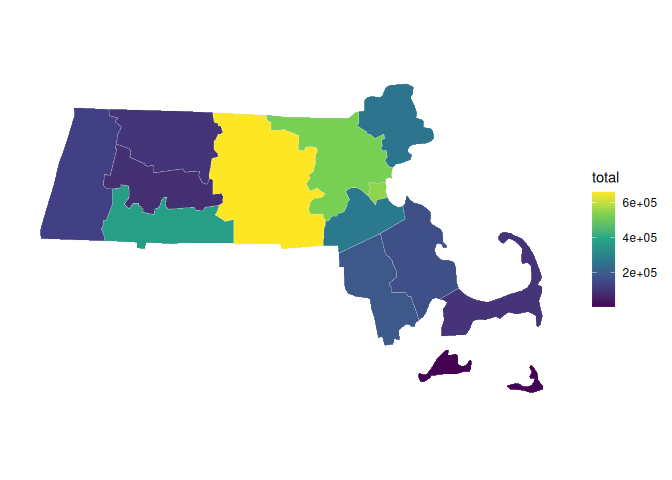
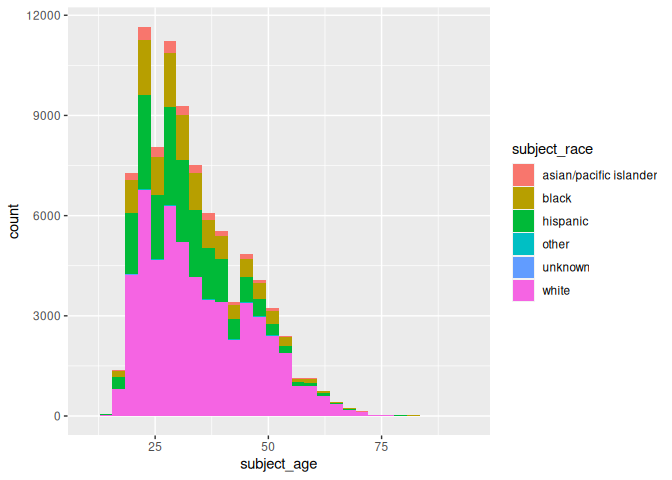
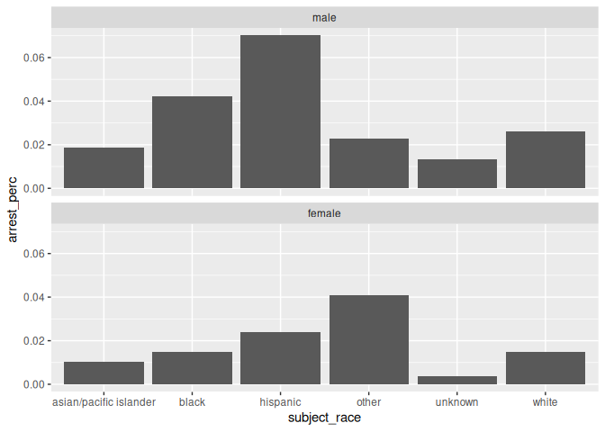

Massachusetts Highway Stops
================
Andrew Mascillaro
2023-04-24

- [Grading Rubric](#grading-rubric)
  - [Individual](#individual)
  - [Due Date](#due-date)
- [Setup](#setup)
  - [**q1** Go to the Stanford Open Policing Project page and download
    the Massachusetts State Police records in `Rds` format. Move the
    data to your `data` folder and match the `filename` to load the
    data.](#q1-go-to-the-stanford-open-policing-project-page-and-download-the-massachusetts-state-police-records-in-rds-format-move-the-data-to-your-data-folder-and-match-the-filename-to-load-the-data)
- [EDA](#eda)
  - [**q2** Do your “first checks” on the dataset. What are the basic
    facts about this
    dataset?](#q2-do-your-first-checks-on-the-dataset-what-are-the-basic-facts-about-this-dataset)
  - [**q3** Check the set of factor levels for `subject_race` and
    `raw_Race`. What do you note about overlap / difference between the
    two
    sets?](#q3-check-the-set-of-factor-levels-for-subject_race-and-raw_race-what-do-you-note-about-overlap--difference-between-the-two-sets)
  - [**q4** Check whether `subject_race` and `raw_Race` match for a
    large fraction of cases. Which of the two hypotheses above is most
    likely, based on your
    results?](#q4-check-whether-subject_race-and-raw_race-match-for-a-large-fraction-of-cases-which-of-the-two-hypotheses-above-is-most-likely-based-on-your-results)
  - [Vis](#vis)
    - [**q5** Compare the *arrest rate*—the fraction of total cases in
      which the subject was arrested—across different factors. Create as
      many visuals (or tables) as you need, but make sure to check the
      trends across all of the `subject` variables. Answer the questions
      under *observations*
      below.](#q5-compare-the-arrest-ratethe-fraction-of-total-cases-in-which-the-subject-was-arrestedacross-different-factors-create-as-many-visuals-or-tables-as-you-need-but-make-sure-to-check-the-trends-across-all-of-the-subject-variables-answer-the-questions-under-observations-below)
- [Modeling](#modeling)
  - [**q6** Run the following code and interpret the regression
    coefficients. Answer the the questions under *observations*
    below.](#q6-run-the-following-code-and-interpret-the-regression-coefficients-answer-the-the-questions-under-observations-below)
  - [**q7** Re-fit the logistic regression from q6 setting `"white"` as
    the reference level for `subject_race`. Interpret the the model
    terms and answer the questions
    below.](#q7-re-fit-the-logistic-regression-from-q6-setting-white-as-the-reference-level-for-subject_race-interpret-the-the-model-terms-and-answer-the-questions-below)
  - [**q8** Re-fit the model using a factor indicating the presence of
    contraband in the subject’s vehicle. Answer the questions under
    *observations*
    below.](#q8-re-fit-the-model-using-a-factor-indicating-the-presence-of-contraband-in-the-subjects-vehicle-answer-the-questions-under-observations-below)
  - [**q9** Go deeper: Pose at least one more question about the data
    and fit at least one more model in support of answering that
    question.](#q9-go-deeper-pose-at-least-one-more-question-about-the-data-and-fit-at-least-one-more-model-in-support-of-answering-that-question)
  - [Further Reading](#further-reading)

*Purpose*: In this last challenge we’ll focus on using logistic
regression to study a large, complicated dataset. Interpreting the
results of a model can be challenging—both in terms of the statistics
and the real-world reasoning—so we’ll get some practice in this
challenge.

<!-- include-rubric -->

# Grading Rubric

<!-- -------------------------------------------------- -->

Unlike exercises, **challenges will be graded**. The following rubrics
define how you will be graded, both on an individual and team basis.

## Individual

<!-- ------------------------- -->

| Category    | Needs Improvement                                                                                                | Satisfactory                                                                                                               |
|-------------|------------------------------------------------------------------------------------------------------------------|----------------------------------------------------------------------------------------------------------------------------|
| Effort      | Some task **q**’s left unattempted                                                                               | All task **q**’s attempted                                                                                                 |
| Observed    | Did not document observations, or observations incorrect                                                         | Documented correct observations based on analysis                                                                          |
| Supported   | Some observations not clearly supported by analysis                                                              | All observations clearly supported by analysis (table, graph, etc.)                                                        |
| Assessed    | Observations include claims not supported by the data, or reflect a level of certainty not warranted by the data | Observations are appropriately qualified by the quality & relevance of the data and (in)conclusiveness of the support      |
| Specified   | Uses the phrase “more data are necessary” without clarification                                                  | Any statement that “more data are necessary” specifies which *specific* data are needed to answer what *specific* question |
| Code Styled | Violations of the [style guide](https://style.tidyverse.org/) hinder readability                                 | Code sufficiently close to the [style guide](https://style.tidyverse.org/)                                                 |

## Due Date

<!-- ------------------------- -->

All the deliverables stated in the rubrics above are due **at midnight**
before the day of the class discussion of the challenge. See the
[Syllabus](https://docs.google.com/document/d/1qeP6DUS8Djq_A0HMllMqsSqX3a9dbcx1/edit?usp=sharing&ouid=110386251748498665069&rtpof=true&sd=true)
for more information.

*Background*: We’ll study data from the [Stanford Open Policing
Project](https://openpolicing.stanford.edu/data/), specifically their
dataset on Massachusetts State Patrol police stops.

``` r
library(tidyverse)
```

    ## ── Attaching packages ─────────────────────────────────────── tidyverse 1.3.2 ──
    ## ✔ ggplot2 3.4.0      ✔ purrr   1.0.1 
    ## ✔ tibble  3.1.8      ✔ dplyr   1.0.10
    ## ✔ tidyr   1.2.1      ✔ stringr 1.5.0 
    ## ✔ readr   2.1.3      ✔ forcats 0.5.2 
    ## ── Conflicts ────────────────────────────────────────── tidyverse_conflicts() ──
    ## ✖ dplyr::filter() masks stats::filter()
    ## ✖ dplyr::lag()    masks stats::lag()

``` r
library(broom)
library(tools)
```

# Setup

<!-- -------------------------------------------------- -->

### **q1** Go to the [Stanford Open Policing Project](https://openpolicing.stanford.edu/data/) page and download the Massachusetts State Police records in `Rds` format. Move the data to your `data` folder and match the `filename` to load the data.

*Note*: An `Rds` file is an R-specific file format. The function
`readRDS` will read these files.

``` r
## TODO: Download the data, move to your data folder, and load it
filename <- "data/yg821jf8611_ma_statewide_2020_04_01.rds"
df_data <- readRDS(filename)
```

# EDA

<!-- -------------------------------------------------- -->

### **q2** Do your “first checks” on the dataset. What are the basic facts about this dataset?

``` r
df_data %>% summary()
```

    ##  raw_row_number          date              location         county_name       
    ##  Length:3416238     Min.   :2007-01-01   Length:3416238     Length:3416238    
    ##  Class :character   1st Qu.:2009-04-22   Class :character   Class :character  
    ##  Mode  :character   Median :2011-07-08   Mode  :character   Mode  :character  
    ##                     Mean   :2011-07-16                                        
    ##                     3rd Qu.:2013-08-27                                        
    ##                     Max.   :2015-12-31                                        
    ##                                                                               
    ##   subject_age                     subject_race     subject_sex     
    ##  Min.   :10.00    asian/pacific islander: 166842   male  :2362238  
    ##  1st Qu.:25.00    black                 : 351610   female:1038377  
    ##  Median :34.00    hispanic              : 338317   NA's  :  15623  
    ##  Mean   :36.47    white                 :2529780                   
    ##  3rd Qu.:46.00    other                 :  11008                   
    ##  Max.   :94.00    unknown               :  17017                   
    ##  NA's   :158006   NA's                  :   1664                   
    ##          type         arrest_made     citation_issued warning_issued 
    ##  pedestrian:      0   Mode :logical   Mode :logical   Mode :logical  
    ##  vehicular :3416238   FALSE:3323303   FALSE:1244039   FALSE:2269244  
    ##                       TRUE :92019     TRUE :2171283   TRUE :1146078  
    ##                       NA's :916       NA's :916       NA's :916      
    ##                                                                      
    ##                                                                      
    ##                                                                      
    ##      outcome        contraband_found contraband_drugs contraband_weapons
    ##  warning :1146078   Mode :logical    Mode :logical    Mode :logical     
    ##  citation:2171283   FALSE:28256      FALSE:36296      FALSE:53237       
    ##  summons :      0   TRUE :27474      TRUE :19434      TRUE :2493        
    ##  arrest  :  92019   NA's :3360508    NA's :3360508    NA's :3360508     
    ##  NA's    :   6858                                                       
    ##                                                                         
    ##                                                                         
    ##  contraband_alcohol contraband_other frisk_performed search_conducted
    ##  Mode :logical      Mode :logical    Mode :logical   Mode :logical   
    ##  FALSE:3400070      FALSE:51708      FALSE:51029     FALSE:3360508   
    ##  TRUE :16168        TRUE :4022       TRUE :3602      TRUE :55730     
    ##                     NA's :3360508    NA's :3361607                   
    ##                                                                      
    ##                                                                      
    ##                                                                      
    ##          search_basis     reason_for_stop    vehicle_type      
    ##  k9            :      0   Length:3416238     Length:3416238    
    ##  plain view    :      0   Class :character   Class :character  
    ##  consent       :   6903   Mode  :character   Mode  :character  
    ##  probable cause:  25898                                        
    ##  other         :  18228                                        
    ##  NA's          :3365209                                        
    ##                                                                
    ##  vehicle_registration_state   raw_Race        
    ##  MA     :3053713            Length:3416238    
    ##  CT     :  82906            Class :character  
    ##  NY     :  69059            Mode  :character  
    ##  NH     :  51514                              
    ##  RI     :  39375                              
    ##  (Other): 109857                              
    ##  NA's   :   9814

Note that we have both a `subject_race` and `race_Raw` column. There are
a few possibilities as to what `race_Raw` represents:

- `race_Raw` could be the race of the police officer in the stop
- `race_Raw` could be an unprocessed version of `subject_race`

Let’s try to distinguish between these two possibilities.

### **q3** Check the set of factor levels for `subject_race` and `raw_Race`. What do you note about overlap / difference between the two sets?

``` r
## TODO: Determine the factor levels for subject_race and raw_Race
df_data %>% pull(subject_race) %>% unique()
```

    ## [1] white                  hispanic               black                 
    ## [4] asian/pacific islander other                  <NA>                  
    ## [7] unknown               
    ## Levels: asian/pacific islander black hispanic white other unknown

``` r
df_data %>% pull(raw_Race) %>% unique()
```

    ## [1] "White"                                        
    ## [2] "Hispanic"                                     
    ## [3] "Black"                                        
    ## [4] "Asian or Pacific Islander"                    
    ## [5] "Middle Eastern or East Indian (South Asian)"  
    ## [6] "American Indian or Alaskan Native"            
    ## [7] NA                                             
    ## [8] "None - for no operator present citations only"
    ## [9] "A"

**Observations**:

- What are the unique values for `subject_race`?
  - white, hispanic, black, aapi, other, NA, and unknown
- What are the unique values for `raw_Race`?
  - white, hispanic, black, aapi, middle eastern / south asian, american
    indian, NA, None, A
- What is the overlap between the two sets?
  - white, hispanic, black, aapi, other/na
- What is the difference between the two sets?
  - middle eastern, american indian

### **q4** Check whether `subject_race` and `raw_Race` match for a large fraction of cases. Which of the two hypotheses above is most likely, based on your results?

*Note*: Just to be clear, I’m *not* asking you to do a *statistical*
hypothesis test.

``` r
## TODO: Devise your own way to test the hypothesis posed above.
simplify_race = function(str_col) {
  str_col %>% 
    as.character() %>% 
    str_replace_all("^A$", "unknown") %>%
    str_replace_all("None - for no operator present citations only", "unknown") %>%
    replace_na("unknown") %>%
    str_to_lower()
}

df_clean <- df_data %>% 
  mutate(
    raw_Race = simplify_race(raw_Race),
    subject_race = simplify_race(subject_race)
  ) %>% 
  rename(
    raw_race = raw_Race
  )

df_clean %>%
  mutate(
    is_same_race = raw_race == subject_race
  ) %>%
  summarize(
    total = n(),
    num_same = sum(is_same_race),
    num_diff = total - num_same,
    perc_same = num_same / total
  )
```

    ## # A tibble: 1 × 4
    ##     total num_same num_diff perc_same
    ##     <int>    <int>    <int>     <dbl>
    ## 1 3416238  3238388   177850     0.948

**Observations**

Between the two hypotheses:

- `race_Raw` could be the race of the police officer in the stop
- `race_Raw` could be an unprocessed version of `subject_race`

which is most plausible, based on your results?

- `race_Raw` is most likely an unprocessed version of `subject_race` as
  the percentage that is the same is extremely high, about 95 percent,
  so it likely refers to the same person as the `subject_race`.

## Vis

<!-- ------------------------- -->

### **q5** Compare the *arrest rate*—the fraction of total cases in which the subject was arrested—across different factors. Create as many visuals (or tables) as you need, but make sure to check the trends across all of the `subject` variables. Answer the questions under *observations* below.

(Note: Create as many chunks and visuals as you need)

``` r
make_county_name = function(county_col) {
  county_col %>% 
    toTitleCase() %>% 
    paste("County")
}

mass_counties <-
  map_data("county") %>% 
    filter(region == "massachusetts") %>% 
    mutate(county_name = make_county_name(subregion))

theme_maps <-
  theme(legend.position="right",
    axis.line=element_blank(),
    axis.text=element_blank(),
    axis.ticks=element_blank(),
    axis.title=element_blank(),
    panel.background=element_blank(),
    panel.border=element_blank(),
    panel.grid=element_blank()
  )
```

``` r
df_clean %>% 
  group_by(county_name) %>% 
  summarize(
    total = n()
  ) %>% 
  left_join(
    mass_counties,
    by = "county_name"
  ) %>% 
  ggplot(aes(x = long, y = lat, group = group, fill = total)) +
  geom_polygon(color = "gray90", size = 0.1) +
  coord_map(projection = "albers", lat0 = 39, lat1 = 45) +
  scale_fill_continuous(type = "viridis") +
  theme_maps
```

    ## Warning: Using `size` aesthetic for lines was deprecated in ggplot2 3.4.0.
    ## ℹ Please use `linewidth` instead.

<!-- -->

``` r
df_clean %>%
  group_by(subject_race) %>% 
  filter(arrest_made == TRUE) %>%
  ggplot(aes(x = subject_age, fill = subject_race)) +
  geom_histogram()
```

    ## `stat_bin()` using `bins = 30`. Pick better value with `binwidth`.

    ## Warning: Removed 2025 rows containing non-finite values (`stat_bin()`).

<!-- -->

``` r
df_clean %>%
  drop_na(arrest_made, subject_sex) %>% 
  group_by(subject_race, subject_sex) %>% 
  summarize(
    arrest_perc = sum(arrest_made) / n()
  ) %>% 
  ggplot(aes(x = arrest_perc, y = subject_race)) +
  geom_col() +
  coord_flip() +
  facet_wrap(~ subject_sex, nrow = 2)
```

    ## `summarise()` has grouped output by 'subject_race'. You can override using the
    ## `.groups` argument.

<!-- -->

**Observations**:

- How does `arrest_rate` tend to vary with `subject_age`?
  - (Your response here)
- How does `arrest_rate` tend to vary with `subject_sex`?
  - (Your response here)
- How does `arrest_rate` tend to vary with `subject_race`?
  - (Your response here)

# Modeling

<!-- -------------------------------------------------- -->

We’re going to use a model to study the relationship between `subject`
factors and arrest rate, but first we need to understand a bit more
about *dummy variables*

### **q6** Run the following code and interpret the regression coefficients. Answer the the questions under *observations* below.

``` r
## NOTE: No need to edit; inspect the estimated model terms.
fit_q6 <-
  glm(
    formula = arrest_made ~ subject_age + subject_race + subject_sex,
    data = df_data %>%
      filter(
        !is.na(arrest_made),
        subject_race %in% c("white", "black", "hispanic")
      ),
    family = "binomial"
  )

fit_q6 %>% tidy()
```

    ## # A tibble: 5 × 5
    ##   term                 estimate std.error statistic   p.value
    ##   <chr>                   <dbl>     <dbl>     <dbl>     <dbl>
    ## 1 (Intercept)           -2.67    0.0132      -202.  0        
    ## 2 subject_age           -0.0142  0.000280     -50.5 0        
    ## 3 subject_racehispanic   0.513   0.0119        43.3 0        
    ## 4 subject_racewhite     -0.380   0.0103       -37.0 3.12e-299
    ## 5 subject_sexfemale     -0.755   0.00910      -83.0 0

**Observations**:

- Which `subject_race` levels are included in fitting the model?
  - White, black, hispanic
- Which `subject_race` levels have terms in the model?
  - White, hispanic

You should find that each factor in the model has a level *missing* in
its set of terms. This is because R represents factors against a
*reference level*: The model treats one factor level as “default”, and
each factor model term represents a change from that “default” behavior.
For instance, the model above treats `subject_sex==male` as the
reference level, so the `subject_sexfemale` term represents the *change
in probability* of arrest due to a person being female (rather than
male).

The this reference level approach to coding factors is necessary for
[technical
reasons](https://www.andrew.cmu.edu/user/achoulde/94842/lectures/lecture10/lecture10-94842.html#why-is-one-of-the-levels-missing-in-the-regression),
but it complicates interpreting the model results. For instance; if we
want to compare two levels, neither of which are the reference level, we
have to consider the difference in their model coefficients. But if we
want to compare all levels against one “baseline” level, then we can
relevel the data to facilitate this comparison.

By default `glm` uses the first factor level present as the reference
level. Therefore we can use
`mutate(factor = fct_relevel(factor, "desired_level"))` to set our
`"desired_level"` as the reference factor.

### **q7** Re-fit the logistic regression from q6 setting `"white"` as the reference level for `subject_race`. Interpret the the model terms and answer the questions below.

``` r
## TODO: Re-fit the logistic regression, but set "white" as the reference
## level for subject_race
fit_q7 <-
  glm(
    formula = arrest_made ~ subject_age + subject_race + subject_sex,
    data = df_data %>%
      filter(
        !is.na(arrest_made),
        subject_race %in% c("white", "black", "hispanic")
      ) %>%
      mutate(
        subject_race = relevel(factor(subject_race), ref = "white")
      ),
    family = "binomial"
  )
fit_q7 %>% tidy()
```

    ## # A tibble: 5 × 5
    ##   term                 estimate std.error statistic   p.value
    ##   <chr>                   <dbl>     <dbl>     <dbl>     <dbl>
    ## 1 (Intercept)           -3.05    0.0109      -279.  0        
    ## 2 subject_age           -0.0142  0.000280     -50.5 0        
    ## 3 subject_raceblack      0.380   0.0103        37.0 3.12e-299
    ## 4 subject_racehispanic   0.893   0.00859      104.  0        
    ## 5 subject_sexfemale     -0.755   0.00910      -83.0 0

**Observations**:

- Which `subject_race` level has the highest probability of being
  arrested, according to this model? Which has the lowest probability?
  - Black is highest, white is lowest
- What could explain this difference in probabilities of arrest across
  race? List **multiple** possibilities.
  - There are a few possibilities, including direct racial bias,
    confounded socioeconomic status (i.e. poorer people get arrested
    more often and are disproportionately minority races), confounded
    neighborhood (more crime takes place in neighborhoods that have more
    crime and more disproportionately high percentages of minority
    races)
- Look at the sent of variables in the dataset; do any of the columns
  relate to a potential explanation you listed?
  - Search basis combined with arrest rate may help determine if racial
    bias was in play, to see if people with minority races were more
    likely to be searched for “probable cause” than white counterparts.

One way we can explain differential arrest rates is to include some
measure indicating the presence of an arrestable offense. We’ll do this
in a particular way in the next task.

### **q8** Re-fit the model using a factor indicating the presence of contraband in the subject’s vehicle. Answer the questions under *observations* below.

``` r
## TODO: Repeat the modeling above, but control for whether contraband was found
## during the police stop
fit_q8 <-
  glm(
    formula = arrest_made ~ subject_age + subject_race + subject_sex + contraband_found,
    data = df_data %>%
      filter(
        !is.na(arrest_made),
        subject_race %in% c("white", "black", "hispanic")
      ) %>%
      mutate(
        subject_race = relevel(factor(subject_race), ref = "white")
      ),
    family = "binomial"
  )
fit_q8 %>% tidy()
```

    ## # A tibble: 6 × 5
    ##   term                 estimate std.error statistic   p.value
    ##   <chr>                   <dbl>     <dbl>     <dbl>     <dbl>
    ## 1 (Intercept)           -1.72    0.0339      -50.8  0        
    ## 2 subject_age            0.0225  0.000866     26.0  2.19e-149
    ## 3 subject_raceblack     -0.0511  0.0270       -1.90 5.80e-  2
    ## 4 subject_racehispanic   0.221   0.0237        9.31 1.32e- 20
    ## 5 subject_sexfemale     -0.306   0.0257      -11.9  1.06e- 32
    ## 6 contraband_foundTRUE   0.609   0.0192       31.7  4.29e-221

**Observations**:

- How does controlling for found contraband affect the `subject_race`
  terms in the model?
  - It shows that the presence of contraband is a stronger indicator of
    arrest rate, but there’s still a similar correlation in arrest rate
    based on race for hispanic people even when controlling for found
    contraband.
- What does the *finding of contraband* tell us about the stop? What
  does it *not* tell us about the stop?
  - This tells us that finding contraband is a stronger indicator of
    arrest rate than race, but it does not tell us that there is no
    racial bias.

### **q9** Go deeper: Pose at least one more question about the data and fit at least one more model in support of answering that question.

Do different counties have different arrest rates?

``` r
fit_q9 <-
  glm(
    formula = arrest_made ~ subject_age + subject_race + subject_sex + county_name,
    data = df_data %>%
      filter(
        !is.na(arrest_made),
        subject_race %in% c("white", "black", "hispanic")
      ) %>%
      mutate(
        subject_race = relevel(factor(subject_race), ref = "white"),
        county_name = relevel(factor(county_name), ref = "Norfolk County")
      ),
    family = "binomial"
  )
fit_q9 %>% tidy()
```

    ## # A tibble: 18 × 5
    ##    term                         estimate std.error statistic  p.value
    ##    <chr>                           <dbl>     <dbl>     <dbl>    <dbl>
    ##  1 (Intercept)                   -3.33    0.0172     -194.   0       
    ##  2 subject_age                   -0.0128  0.000282    -45.5  0       
    ##  3 subject_raceblack              0.420   0.0104       40.2  0       
    ##  4 subject_racehispanic           0.882   0.00875     101.   0       
    ##  5 subject_sexfemale             -0.753   0.00913     -82.6  0       
    ##  6 county_nameBarnstable County   0.189   0.0258        7.33 2.22e-13
    ##  7 county_nameBerkshire County   -0.155   0.0266       -5.84 5.36e- 9
    ##  8 county_nameBristol County      0.843   0.0173       48.7  0       
    ##  9 county_nameDukes County        0.253   0.0965        2.62 8.75e- 3
    ## 10 county_nameEssex County        0.682   0.0168       40.7  0       
    ## 11 county_nameFranklin County    -0.275   0.0299       -9.23 2.82e-20
    ## 12 county_nameHampden County      0.238   0.0167       14.3  2.94e-46
    ## 13 county_nameHampshire County   -0.257   0.0312       -8.24 1.67e-16
    ## 14 county_nameMiddlesex County    0.248   0.0164       15.2  7.47e-52
    ## 15 county_nameNantucket County    0.753   0.0640       11.8  6.34e-32
    ## 16 county_namePlymouth County     0.331   0.0201       16.5  3.32e-61
    ## 17 county_nameSuffolk County     -0.0932  0.0169       -5.51 3.55e- 8
    ## 18 county_nameWorcester County    0.158   0.0157       10.1  6.63e-24

The baseline county is Norfolk County because that’s where Olin is. No
other logic necessary :) (don’t dock points for this)

**Observations**:

- Which counties have higher arrest rates?
  - Bristol County and Essex county have higher arrest rates
  - Barnstable and Dukes County are similar but slightly higher
  - Berkshire County is lower
- Can I make any conclusions about the counties themselves from this?
  - Further knowledge of Massachusetts would be helpful to know what
    makes these counties different from each other (ideally stats on
    income, etc) but there is a reason to look more into why the arrest
    rates are presumably higher and lower depending on county.
- What other data would help make further conclusions?
  - More fine-grained data about location, like city, neighborhood, and
    time of day

## Further Reading

<!-- -------------------------------------------------- -->

- Stanford Open Policing Project
  [findings](https://openpolicing.stanford.edu/findings/).
